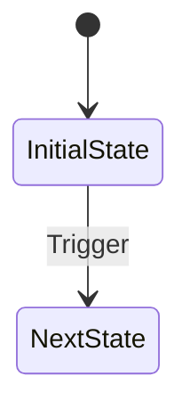

# spec-detail — Detailed Spec

Writes the detailed documents (ui / flow / api) based on the spec draft.
Both the page and the document type can be specified. If unspecified, all DRAFT pages are processed in bulk.
Use when the user asks for "v1 detailed spec" or "v1 order-management ui".

## Instructions

Perform the following steps in order.

### 1. Version Check

- If the user specified a version, use it (e.g., v1, v2)
- If unspecified, use the version currently in progress

### 2. Understand the Requirements Context

- Read `.specs/v{N}/PRD.md` to understand the detailed context of the requirements

### 3. Identify the Project Guides

- Read the "Reference Documents" section in `CLAUDE.md` to identify the `docs/` guide list

### 4. Determine the Target

- **Page + document type specified** → generate only that document (e.g., `v1 order-management ui`)
- **Page only specified** → generate that page's `ui.md` + `flow.md` + `api.md` in bulk
- **Unspecified** → generate detailed documents in bulk for all pages in DRAFT status

### 5. Write Detailed Documents Based on spec.md

- Read the target page's `spec.md` to understand the overview, then write the detailed documents

### 6. Per-Document Standards

#### ui.md — Screen Composition Detail

```markdown
# Screen Composition

## 1. List Page

### Layout

(ASCII art or a structural description)

### Table Columns / Card Composition

| Column | Field | Type | Notes |
| ------ | ----- | ---- | ----- |
| ...    | ...   | ...  | ...   |

## 2. Detail Page

### Form Fields

| Field | Component | Required | Validation Rule |
| ----- | --------- | -------- | --------------- |
| ...   | ...       | ...      | ...             |
```

Core content: layout, table columns, form fields, component mapping

#### flow.md — User Flow / State Transitions

````markdown
# User Flow

## 1. Default Flow

1. (Step-by-step flow description)

## 2. State Transitions



## 3. Edge Cases

- (Exceptional situations and how to handle them)
````

Core content: default flow (step-by-step), state transitions (mermaid), edge cases

#### api.md — API Integration Spec

```markdown
# API Integration

## Read APIs

### {API Name}

- Endpoint / query: ...
- Parameters: ...
- Caching strategy: ...

## Mutation APIs

### {API Name}

- Endpoint / mutation: ...
- Side effects: ...

## Filter / Sort Mapping

| UI Filter | API Condition |
| --------- | ------------- |
| ...       | ...           |
```

Core content: read / mutation API definitions, parameters, caching strategy, filter mapping

### 7. Maintain Consistency

- Follow the patterns of the related project guides (`docs/`)
- Maintain stylistic consistency with already-written pages

### 8. Apply the Quality Bar

Each detailed document must reflect the following criteria:

#### ui.md — Toss-grade Completeness

- Specify a **loading state** (skeleton / spinner), **empty state** (guidance message + action), and **error state** (retry option) on every screen
- Define interaction feedback (button click, form submit, delete, etc.) and transition animations
- Include responsive layout and accessibility considerations (keyboard navigation, focus management)

#### flow.md — Fast Perceived Speed

- Identify actions to which Optimistic UI applies, and specify the optimistic-update flow and rollback scenarios
- Design the flow to minimize sections where the user has to wait (prefetch, background sync, etc.)
- Include error-recovery flows so the user experience does not break on failure

#### api.md — Forbes TOP 10 Caliber

- Drive the spec's feature depth all the way down to the API layer. Where needed, specify aggregation / filter / sort / export APIs
- Verify that each API is sufficient for real-world use (parameters, response shape, error handling)
- Concretely define caching, pagination, and real-time update strategies
