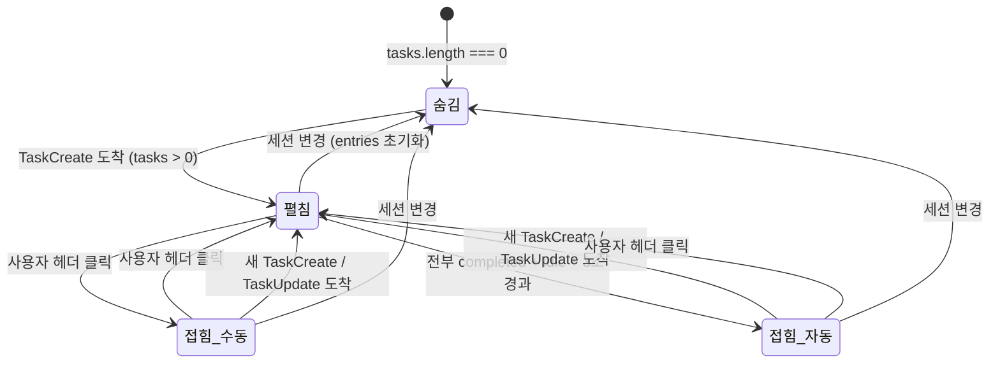

# 사용자 흐름

## 1. task 등장 → 체크리스트 표시 흐름

```
1. Claude CLI가 복잡한 작업 시작
2. TaskCreate tool_use가 JSONL에 기록 (4개 task 연속 생성)
3. 서버: fs.watch → parseIncremental → task-progress 엔트리 4개 생성
4. 서버: timeline:append로 클라이언트에 전달
5. 클라이언트: handleAppend → entries에 추가
6. useMemo: entries에서 task-progress 필터링 → ITaskItem[4] 생성
   taskId "1" pending, "2" pending, "3" pending, "4" pending
7. TaskChecklist 컴포넌트 렌더링 (animate-in)
8. 헤더: "0 / 4" + 접기 아이콘
```

## 2. task 진행 → 실시간 업데이트 흐름

```
1. Claude CLI: TaskUpdate { taskId: "1", status: "in_progress" }
2. 파서 → task-progress (action: 'update') 엔트리
3. 클라이언트: useMemo 재계산
   taskId "1" in_progress, "2" pending, "3" pending, "4" pending
4. UI 업데이트:
   - "1" 아이콘: 빈 원 → 펄스 닷
   - "1" 텍스트: muted → foreground + font-medium
   - 헤더: "0 / 4" 유지
   - 좌측 보더: border-ui-purple

5. Claude CLI: TaskUpdate { taskId: "1", status: "completed" }
6. 클라이언트: useMemo 재계산
   taskId "1" completed, "2" pending, "3" pending, "4" pending
7. UI 업데이트:
   - "1" 아이콘: 펄스 닷 → CheckCircle2 (text-positive)
   - "1" 텍스트: foreground → muted + line-through
   - 헤더: "1 / 4"

8. 반복: "2" in_progress → completed → "3" ... → "4" completed
```

## 3. 전부 완료 → 자동 접힘 흐름

```
1. 마지막 task completed → 헤더 "4 / 4"
2. 좌측 보더: border-ui-purple → border-positive
3. 헤더 아이콘: ListChecks → CheckCircle2 (text-positive)
4. CLI가 작업 종료 → cliState 'busy' → 'idle'
5. 조건 충족: 모든 task completed + cliState idle
6. 3초 타이머 시작
7. 타이머 만료 → collapsed = true
8. 목록 접힘: 헤더만 표시
```

## 4. 접기/펼치기 수동 토글 흐름

```
펼침 → 접힘:
  1. 사용자: 헤더 영역 클릭
  2. collapsed = true
  3. ChevronDown 아이콘: 0° → -90° 회전
  4. 목록 영역 숨김
  5. 접힌 상태: 헤더 + 현재 in_progress subject 표시

접힘 → 펼침:
  1. 사용자: 헤더 영역 클릭
  2. collapsed = false
  3. ChevronDown 아이콘: -90° → 0° 회전
  4. 목록 영역 표시
```

## 5. 자동 펼침 흐름

```
접힌 상태에서:
  1. 새 TaskCreate 도착 → tasks 배열 변경 감지
  2. collapsed = false (자동 펼침)
  3. 목록에 새 task 항목 추가

또는:
  1. TaskUpdate 도착 → task status 변경 감지
  2. collapsed = false (자동 펼침)
```

## 6. 상태 전이



## 7. 엣지 케이스

### 세션 중간 로드 (tail mode)

```
JSONL > 1MB → 마지막 512KB만 파싱
  └── 앞쪽 TaskCreate 누락 가능
      ├── TaskUpdate만 도착한 경우:
      │   └── 매칭할 task 없음 → 해당 update 무시
      └── 일부 TaskCreate만 도착한 경우:
          └── 파싱된 만큼만 표시 (불완전하지만 안전)
```

### task 10개 이상

```
TaskCreate 12개 생성
  └── 목록 max-h-[240px] 초과
      └── overflow-y-auto로 스크롤
          └── in_progress 항목이 보이도록 자동 스크롤 고려 (선택)
```

### 자동 접힘 타이머 도중 새 task 도착

```
1. 전부 completed + idle → 3초 타이머 시작
2. 1.5초 경과
3. 새 TaskCreate 도착 → tasks 변경 감지
4. 타이머 취소 + collapsed = false
5. 새 task 항목 목록에 추가
```

### cliState 변동으로 타이머 취소

```
1. 전부 completed + idle → 3초 타이머 시작
2. 2초 경과
3. cliState: idle → busy (사용자가 새 메시지 입력)
4. 조건 불충족 → 타이머 취소
5. 다시 idle이 되면 새로 3초 타이머 시작
```

### 세션 변경

```
세션 A에서 task 4개 진행 중
  └── 사용자가 세션 B로 전환 (또는 새 세션 시작)
      └── entries 초기화 → useMemo 재계산 → tasks = []
          └── TaskChecklist 숨김
```
