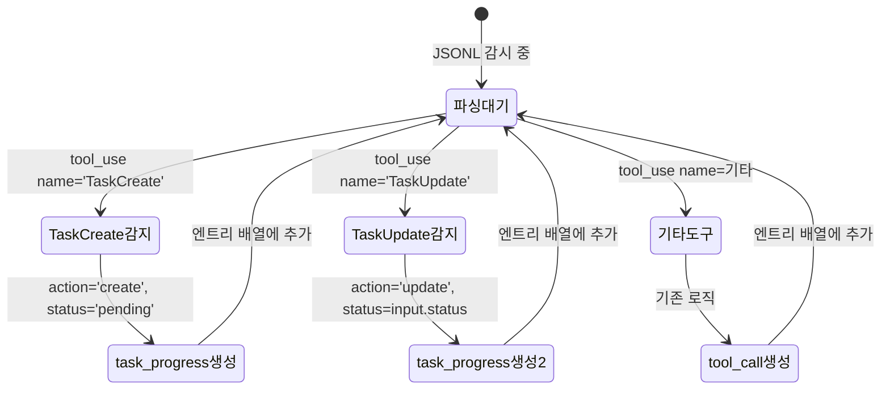

# 사용자 흐름

## 1. 파싱 흐름

```
Claude CLI가 JSONL에 assistant 엔트리 작성
  └── message.content[] 에 tool_use 블록 포함

parseIncremental() → parseContent() → parseSingleEntry()
  └── assistant 타입 → content 순회
      ├── tool_use.name === 'TaskCreate'
      │   └── task-progress 엔트리 생성 (action: 'create')
      │       subject: input.subject
      │       description: input.description
      │       status: 'pending'
      │       taskId: '' (클라이언트에서 할당)
      │       → tool-call 엔트리는 생성하지 않음
      │
      ├── tool_use.name === 'TaskUpdate'
      │   └── task-progress 엔트리 생성 (action: 'update')
      │       taskId: input.taskId
      │       status: input.status
      │       → tool-call 엔트리는 생성하지 않음
      │
      ├── tool_use.name === 'TaskGet' / 'TaskList' / 'TaskStop'
      │   └── 기존 tool-call 엔트리 생성 (변경 없음)
      │
      └── 기타 tool_use
          └── 기존 tool-call 엔트리 생성 (변경 없음)
```

## 2. 전달 흐름

```
서버:
  startFileWatch() → fs.watch 감지
  └── parseIncremental() 호출
      └── task-progress 엔트리 포함된 결과 반환
          └── broadcastToWatcher() → timeline:append 메시지로 전송 (변경 없음)

클라이언트:
  use-timeline-websocket.ts → onAppend 콜백
  └── handleAppend() → entries 배열에 task-progress 엔트리 추가
      └── useMemo → ITaskItem[] 파생 (task-checklist-ui feature에서 처리)
```

## 3. 초기 로드 흐름

```
세션 구독 시:
  subscribeToFile() → parseSessionFile()
  └── parseContent() 호출
      └── 과거 TaskCreate/TaskUpdate 모두 파싱
          └── timeline:init 메시지에 task-progress 엔트리 포함
              └── 클라이언트에서 전체 task 상태 재구성
```

## 4. tool-result 처리

```
TaskCreate/TaskUpdate의 tool_result가 user 엔트리로 도착
  └── parseSingleEntry() → user 타입 → tool_result 블록
      └── toolUseId로 매칭 시도
          └── task-progress 엔트리에는 toolUseId 없음
              └── 매칭 실패 → tool-result만 entries에 추가 (문제 없음)
```

## 5. 상태 전이



## 6. 엣지 케이스

### tail mode (세션 중간 로드)

```
JSONL 크기 > 1MB → parseTailMode()
  └── 마지막 512KB만 읽음
      └── 앞쪽 TaskCreate가 잘릴 수 있음
          └── 클라이언트에서 TaskUpdate만 도착
              └── 매칭되지 않는 taskId → 무시 (불완전하지만 안전)
```

### 같은 assistant 엔트리에 TaskCreate + TaskUpdate 동시 존재

```
content: [
  { type: 'tool_use', name: 'TaskCreate', ... },
  { type: 'tool_use', name: 'TaskUpdate', ... },
  { type: 'tool_use', name: 'Bash', ... },
]
  └── 순서대로 처리:
      1. TaskCreate → task-progress (create)
      2. TaskUpdate → task-progress (update)
      3. Bash → tool-call (기존)
      → 하나의 assistant 엔트리에서 3개 엔트리 생성
```

### isSidechain (서브에이전트 내부)

```
서브에이전트 내부의 TaskCreate/TaskUpdate
  └── isSidechain === true → createAgentGroup()으로 묶임
      └── 개별 파싱되지 않음 → task-progress 미생성
      → 서브에이전트 task는 체크리스트에 표시되지 않음 (의도된 동작)
```
