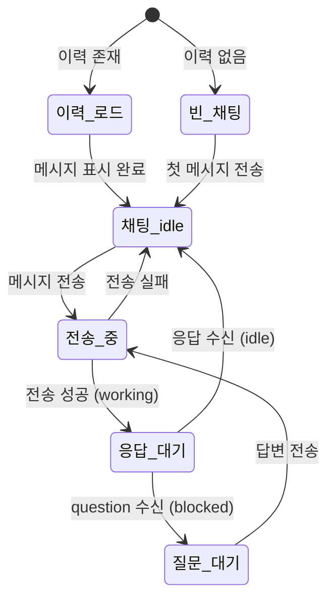

# 사용자 흐름

## 1. 첫 대화 시작 흐름

```
1. 사용자: /agents/{agentId}/chat 진입
2. 클라이언트: GET /api/agent/{agentId}/chat — 이력 조회
3. 이력 없음 → 빈 상태 UI 표시
4. WebSocket 연결 (/api/agent-status)
5. 사용자: 메시지 입력 + Enter
6. Optimistic UI: 사용자 말풍선 즉시 표시
7. API: POST /api/agent/{agentId}/send
8. 서버: 에이전트 idle 확인 → tmux send-keys
9. 클라이언트: 에이전트 상태 → 'working' (WebSocket)
10. 타이핑 인디케이터 표시
11. 에이전트 응답: WebSocket agent:message 수신
12. 에이전트 말풍선 표시 + 타이핑 인디케이터 제거
13. 자동 스크롤
```

## 2. question 메시지 응답 흐름

```
1. 에이전트: question 메시지 전송
   { type: 'question', content: 'JWT vs Session?' }
2. 클라이언트: question 스타일 말풍선 표시
3. 에이전트 상태 → 'blocked'
4. 입력 필드 활성 (blocked 상태에서 입력 가능)
5. 사용자: 답변 입력 + 전송
6. Optimistic UI: 사용자 말풍선 표시
7. 서버: 에이전트에 답변 전달
8. 에이전트 상태 → 'working'
9. 타이핑 인디케이터 표시
```

## 3. approval 메시지 처리 흐름

```
1. 에이전트: approval 메시지 전송
   { type: 'approval', content: 'main에 push해도 될까요?' }
2. 클라이언트: approval 스타일 말풍선 + [승인][거부] 버튼
3. 에이전트 상태 → 'blocked'
4. 사용자: "승인" 버튼 클릭
5. 버튼 → "승인됨" 텍스트로 전환 (비활성화)
6. 사용자 메시지로 "승인" 자동 전송
7. 에이전트 상태 → 'working'
```

## 4. 이전 메시지 로드 흐름 (무한 스크롤)

```
1. 사용자: 메시지 영역 위로 스크롤
2. 스크롤 상단 도달 감지 (IntersectionObserver)
3. hasMore === true → GET /api/agent/{agentId}/chat?before={oldestId}
4. 로딩 스피너 표시 (상단)
5. 이전 메시지 prepend
6. 스크롤 위치 유지 (현재 보던 메시지가 그대로 보이도록)
7. hasMore === false → 더 이상 로드하지 않음
```

## 5. 실시간 메시지 수신 흐름

```
사용자가 채팅 페이지를 보고 있는 동안:
  1. WebSocket agent:message 수신
  2. messages 배열에 추가
  3. 스크롤 위치 확인:
     ├── 하단 → 자동 스크롤
     └── 위로 스크롤된 상태 → "새 메시지" 플로팅 버튼 표시
  4. "새 메시지" 버튼 클릭 → 최신 메시지로 스크롤
```

## 6. 연결 복구 흐름

```
1. WebSocket 연결 끊김 감지
2. 상단 배너: "연결이 끊어졌습니다. 재연결 중..."
3. 자동 재연결 시도 (3초 간격, 최대 5회)
4. 재연결 성공:
   a. 배너 제거
   b. 끊긴 동안의 메시지 재동기화 (GET /api/agent/{agentId}/chat)
5. 재연결 실패 (5회 초과):
   a. 배너: "연결할 수 없습니다. 새로고침해주세요"
```

## 7. 상태 전이



## 8. 엣지 케이스

### 빠른 연속 전송

```
사용자가 메시지를 빠르게 여러 번 전송:
  └── 전송 버튼 debounce (300ms)
      └── 첫 전송 후 입력 비활성화 (working 상태)
```

### 에이전트 세션 죽음 중 메시지 전송

```
전송 시 에이전트 offline 감지:
  └── 서버가 자동 재시작 시도
      ├── 성공 → 메시지 큐잉 후 전달
      └── 실패 → toast.error('에이전트가 응답할 수 없습니다')
```

### 장시간 응답 대기

```
에이전트가 5분 이상 응답 없음:
  └── 타이핑 인디케이터 유지 (타임아웃 없음)
      └── 사용자가 원하면 새 메시지로 중단 요청 가능
```

### 페이지 이탈 후 복귀

```
채팅 페이지에서 다른 페이지 이동 후 복귀:
  └── WebSocket 재연결
      └── 이탈 동안 수신된 메시지 동기화
```
