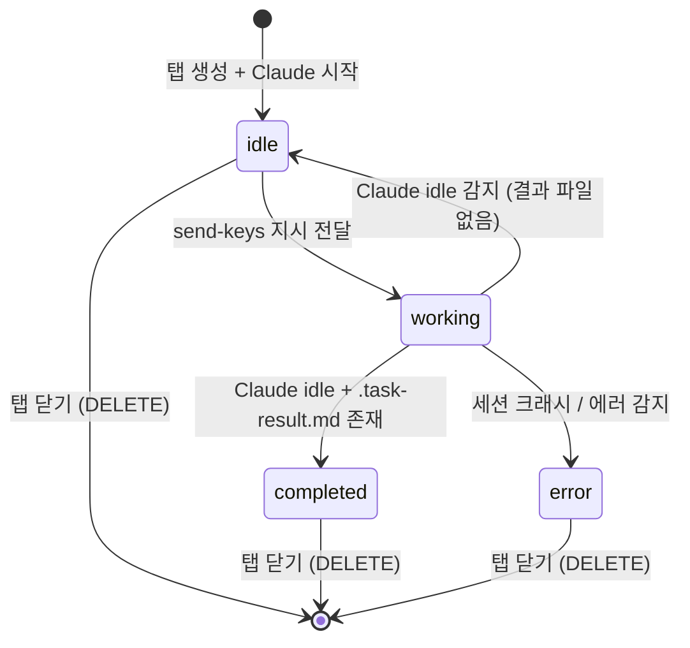
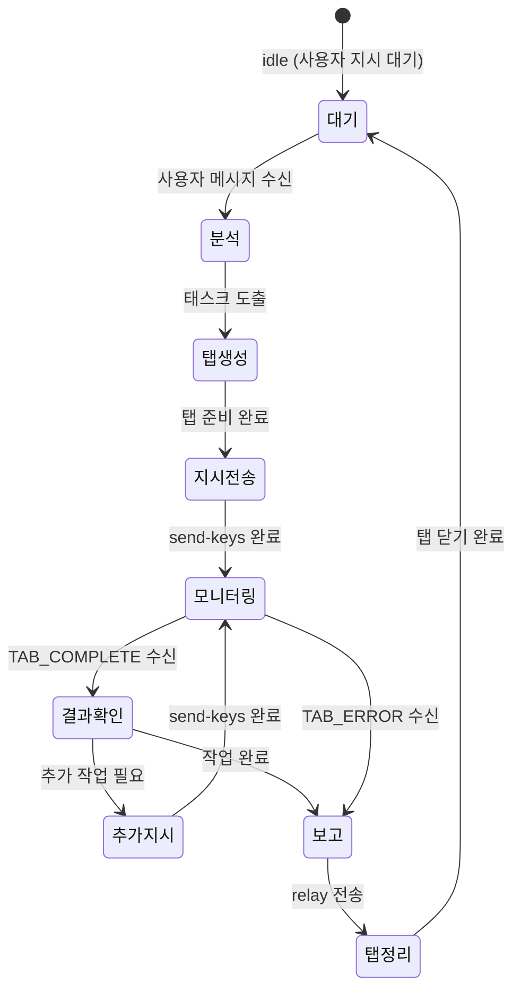

# 사용자 흐름

## 1. 에이전트가 탭을 생성하여 작업하는 기본 흐름

```
1. 사용자: 채팅에서 에이전트에게 지시
   "A 프로젝트 README 업데이트해줘"
2. 에이전트 Brain: 지시 분석 → 태스크 도출
3. 에이전트 Brain: 탭 생성 요청
   curl POST /api/agent/{id}/tab
   { workspaceId: "A-project-ws", taskTitle: "README 업데이트" }
4. 서버: purplemux 워크스페이스에 탭 생성
   a. tmux createSession (pt-{wsId}-{paneId}-{tabId})
   b. 500ms 대기 → claude --dangerously-skip-permissions 실행
   c. 2000ms 대기 → Enter (trust 프롬프트 자동 승인)
   d. 탭 매핑 등록 (agentId + tabId)
   e. tabs.json 동기화
   f. 응답: { tabId, workspaceId, tmuxSession }
5. 에이전트 Brain: 탭에 작업 지시 전송
   curl POST /api/agent/{id}/tab/{tabId}/send
   { content: "README.md를 읽고 프로젝트 구조에 맞게 업데이트해줘" }
6. 서버: 탭의 Claude Code에 tmux send-keys로 전달
7. 탭의 Claude Code: 작업 수행
8. 서버: 탭 상태 모니터링 (5초 폴링)
   - Claude busy → tab status: working
   - Claude idle → tab status: idle
9. 에이전트 Brain: 사용자에게 중간보고
   curl POST /api/agent/message
   { type: "report", content: "README 업데이트 작업 시작했습니다" }
10. 탭의 Claude Code: 작업 완료 (idle 전환)
11. 에이전트 Brain: 탭 결과 확인
    curl GET /api/agent/{id}/tab/{tabId}/result
12. 에이전트 Brain: 사용자에게 완료 보고
    curl POST /api/agent/message
    { type: "done", content: "README 업데이트 완료. 변경 사항: ..." }
13. 에이전트 Brain: 탭 닫기
    curl DELETE /api/agent/{id}/tab/{tabId}
```

## 2. 병렬 태스크 실행 흐름

```
1. 사용자: "프론트엔드 컴포넌트 A, B, C 각각 리팩토링해줘"
2. 에이전트 Brain: 3개 태스크로 분리
3. 에이전트 Brain: 탭 3개 동시 생성
   curl POST /api/agent/{id}/tab  ← 탭 A
   curl POST /api/agent/{id}/tab  ← 탭 B
   curl POST /api/agent/{id}/tab  ← 탭 C
4. 에이전트 Brain: 각 탭에 지시 전송
   탭 A: "컴포넌트 A를 리팩토링해줘"
   탭 B: "컴포넌트 B를 리팩토링해줘"
   탭 C: "컴포넌트 C를 리팩토링해줘"
5. 서버: 3개 탭 독립 모니터링
6. 탭 A 완료 알림 → 에이전트 Brain 수신
   "[TAB_COMPLETE] tabId=A status=completed"
7. 에이전트 Brain: A 결과 확인 + 사용자에게 중간보고
8. 탭 B 완료 → 같은 처리
9. 탭 C 완료 → 전체 완료 보고
10. 에이전트 Brain: 3개 탭 모두 닫기
```

## 3. 대화형 작업 흐름 (멀티턴)

```
1. 에이전트 Brain: 탭 생성 + 초기 지시
   "현재 인증 구조를 분석해줘"
2. 탭 Claude Code: 분석 완료 (idle)
3. 에이전트 Brain: 탭 결과 읽기 → 분석 내용 확인
4. 에이전트 Brain: 추가 지시 전송
   "JWT 방식으로 전환하는 마이그레이션 계획을 작성해줘"
5. 탭 Claude Code: 계획 작성 완료 (idle)
6. 에이전트 Brain: 결과 확인 → 사용자에게 계획 공유
   curl POST /api/agent/message
   { type: "question", content: "JWT 전환 계획입니다: ... 진행할까요?" }
7. 사용자: "진행해" 응답
8. 에이전트 Brain: 탭에 실행 지시
   "계획대로 구현해줘"
9. 탭 Claude Code: 구현 수행
```

## 4. 탭 완료 감지 + 에이전트 알림 흐름

```
1. 서버: 에이전트 탭 목록에서 모니터링 대상 추출
2. 5초 폴링 주기로 각 탭 상태 확인:
   a. hasSession() → 세션 존재 여부
   b. getSessionPanePid() → PID 추출
   c. detectActiveSession() → Claude 실행 상태
   d. deriveStatusFromSession() → idle/working 판별
3. 상태 변경 감지 (working → idle):
   a. 프로젝트 디렉토리에서 .task-result.md 확인
   b. 존재 → completed로 판정
   c. 미존재 → idle (추가 지시 대기)
4. 에이전트 Brain 세션에 알림 전달:
   tmux send-keys agent-{id}
   "[TAB_COMPLETE] tabId={tabId} status=completed"
5. WebSocket broadcast:
   { type: "workspace:tab-updated", agentId, tabId, status }
```

## 5. 서버 재시작 시 탭 매핑 복원 흐름

```
1. 서버 시작 → AgentManager.init()
2. scanExistingAgents():
   a. ~/.purplemux/agents/ 디렉토리 스캔
   b. 각 에이전트의 tabs.json 읽기
   c. tmux 세션 존재 여부 확인
3. 복원:
   ├── 에이전트 세션 존재 + 탭 세션 존재 → 매핑 복원, 모니터링 재개
   ├── 에이전트 세션 존재 + 탭 세션 없음 → tabs.json에서 해당 탭 제거
   └── 에이전트 세션 없음 → startAgentSession() (기존 로직)
4. orphan 탭 정리:
   - agentId 태그가 있으나 에이전트가 없는 tmux 세션 → kill
```

## 6. 상태 전이

### 에이전트 탭 상태



### 에이전트 Brain 작업 루프



## 7. Optimistic UI / 체감 속도

- **탭 생성**: 서버 API 응답 즉시 에이전트가 다음 단계 진행 (탭 내 Claude 시작은 비동기)
- **탭 상태 변경**: WebSocket push로 UI 즉시 반영 (폴링 결과 기다리지 않음)
- **결과 읽기**: 파일 우선 (단일 I/O), jsonl은 tail 8KB만 (대용량 세션에서도 빠름)

## 8. 엣지 케이스

### 동시 탭 제한 초과

```
에이전트가 6번째 탭 생성 시도 (제한: 5개)
  └── 서버: 429 응답 { error: "Max concurrent tabs reached", limit: 5 }
      └── 에이전트: 기존 탭 완료 대기 후 재시도
```

### 탭 세션 크래시

```
탭의 Claude Code가 OOM/세그폴트로 종료
  └── 서버: 폴링에서 세션 죽음 감지
      └── 에이전트에 [TAB_ERROR] 알림
          └── 에이전트: 사용자에게 error 리포트 + 재시도 판단
```

### 워크스페이스 없는 프로젝트

```
에이전트가 할당된 프로젝트의 워크스페이스가 아직 없음
  └── 탭 생성 API: 400 + 사용 가능한 워크스페이스 목록
      └── 에이전트: 사용자에게 question 전송
          "프로젝트 X의 워크스페이스가 없습니다. 생성할까요?"
```

### 에이전트 삭제 시 활성 탭 존재

```
사용자가 에이전트 삭제 요청
  └── 서버: 에이전트 소유 탭 전체 순회
      └── 각 탭 tmux 세션 kill
      └── tabs.json 삭제
      └── 에이전트 Brain 세션 kill
```
