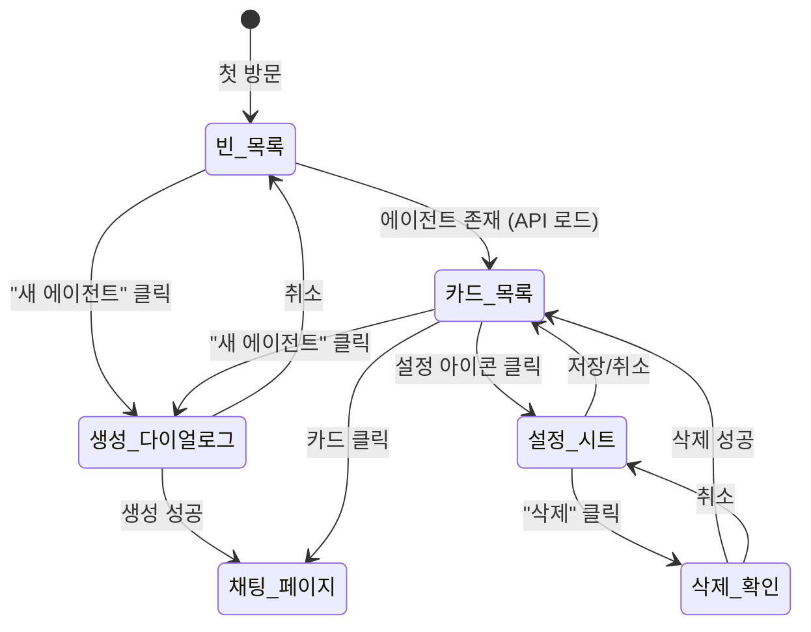

# 사용자 흐름

## 1. 에이전트 생성 흐름

```
1. 사용자: /agents 페이지 진입
2. 사용자: "새 에이전트" 버튼 클릭
3. 다이얼로그 표시 (이름 입력 필드에 자동 포커스)
4. 사용자: 이름, 역할, 담당 프로젝트 입력
5. 사용자: "만들기" 클릭
6. Optimistic UI: 다이얼로그 닫힘 + 카드 목록에 'offline' 상태 카드 즉시 추가
7. API: POST /api/agent → 서버에서 세션 생성
8. 성공:
   a. 카드 상태 → 'idle' (WebSocket push)
   b. 자동으로 /agents/{agentId}/chat 페이지로 이동
9. 실패:
   a. 롤백 — 추가된 카드 제거
   b. toast.error('에이전트 생성에 실패했습니다')
```

## 2. 에이전트 설정 수정 흐름

```
1. 사용자: 카드의 설정 아이콘(Settings) 클릭
   (이벤트 전파 차단 — 카드 클릭과 분리)
2. Sheet 열림 (side="right")
3. 사용자: 필드 수정
4. 사용자: "저장" 클릭
5. API: PATCH /api/agent/{agentId}
6. 성공: Sheet 닫힘 + toast.success('설정이 저장되었습니다')
7. 실패: toast.error + Sheet 유지
```

## 3. 에이전트 삭제 흐름

```
1. 사용자: 설정 Sheet 하단의 "에이전트 삭제" 클릭
2. 삭제 확인 다이얼로그 표시
3. 사용자: 에이전트 이름 입력
4. 이름 일치 시 삭제 버튼 활성화
5. 사용자: "삭제" 클릭
6. Optimistic UI: 카드 fade-out
7. API: DELETE /api/agent/{agentId}
8. 성공: 다이얼로그 + Sheet 닫힘, 목록 갱신
9. 실패: 롤백 — 카드 복원 + toast.error
```

## 4. 에이전트 카드 클릭 → 채팅 이동 흐름

```
1. 사용자: 에이전트 카드 클릭
2. 페이지 이동: /agents/{agentId}/chat
```

## 5. 헤더 진입 흐름

```
1. 어느 페이지에서든 헤더의 에이전트 아이콘 클릭
2. /agents 페이지로 이동
3. blocked 에이전트가 있으면 뱃지 숫자로 시각적 알림
```

## 6. 상태 전이



## 7. 엣지 케이스

### 에이전트 이름 중복

```
생성 다이얼로그에서 이름 입력
  └── blur 시 중복 검사 (로컬 목록 비교)
      └── 중복 → 입력 필드 아래 에러 메시지 "이미 사용 중인 이름입니다"
```

### 에이전트 상태 실시간 변경

```
목록 페이지를 보고 있는 동안:
  └── WebSocket으로 상태 변경 수신
      └── 해당 카드의 뱃지 즉시 갱신 (애니메이션 전환)
```

### 워크스페이스 없음

```
프로젝트 선택 체크박스:
  └── 워크스페이스가 0개면 "등록된 워크스페이스가 없습니다" 안내
      └── 프로젝트 없이도 에이전트 생성 가능
```
