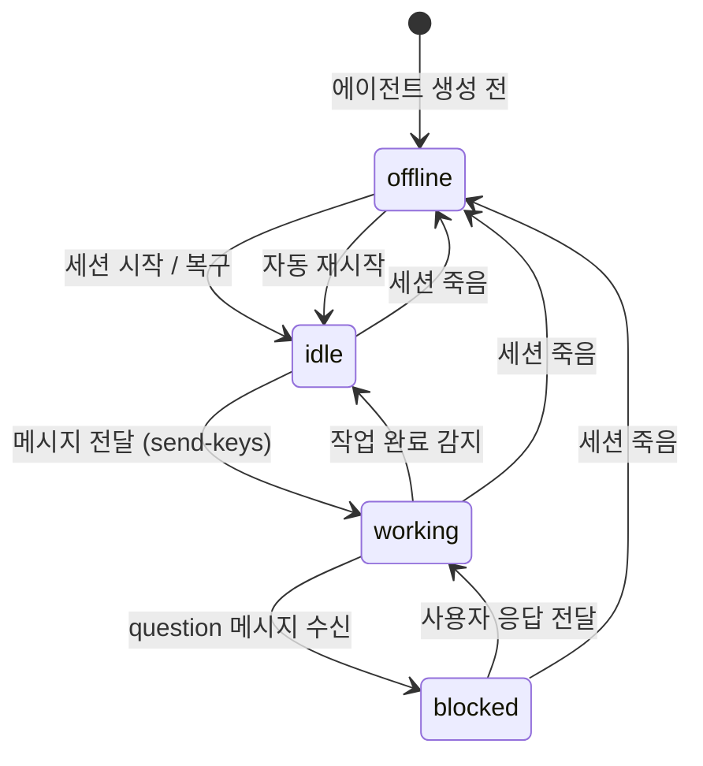

# 사용자 흐름

## 1. 에이전트 세션 시작 흐름

```
1. 사용자: 에이전트 생성 요청 (POST /api/agent)
2. 서버: ~/.purplemux/agents/{agentId}/ 디렉토리 생성
3. 서버: config.md 저장 (이름, 역할, 프로젝트)
4. 서버: chat/index.json 초기화 ({ sessions: [] })
5. 서버: tmux 세션 생성
   - tmux -L purple new-session -d -s agent-{agentId}
   - 작업 디렉토리: 에이전트 CLAUDE.md가 있는 경로
6. 서버: Claude Code 실행 (tmux send-keys)
   - claude --dangerously-skip-permissions
7. 서버: 상태 감지 시작 — 기존 로직으로 세션 모니터링
8. 서버: WebSocket broadcast — 에이전트 상태 'idle'
```

## 2. 사용자 → 에이전트 메시지 전달 흐름

```
1. 사용자: 채팅 UI에서 메시지 입력 + 전송
2. 클라이언트: POST /api/agent/{agentId}/send { content }
3. 서버: 에이전트 상태 확인
   ├── idle → 즉시 전달
   └── working → 메시지 큐에 추가
4. 서버 (idle 시):
   a. JSONL에 메시지 기록 (role: 'user')
   b. tmux send-keys로 에이전트 세션에 전달
   c. 에이전트 상태 → 'working'
   d. WebSocket broadcast — 상태 변경
5. 서버 (큐잉 시):
   a. JSONL에 메시지 기록 (role: 'user', queued: true)
   b. 에이전트 idle 전환 감지 시 순차 전달
```

## 3. 에이전트 → 사용자 메시지 수신 흐름

```
1. 에이전트 Claude Code 세션: curl POST /api/agent/message
   { agentId, type: 'report', content: '분석 완료했습니다...' }
2. 서버: 메시지 수신
3. 서버: JSONL에 기록 (role: 'agent')
4. 서버: WebSocket push — 채팅 UI에 전달
5. 클라이언트: 메시지 표시 + 자동 스크롤
6. type이 'question'인 경우:
   a. 에이전트 상태 → 'blocked'
   b. 알림 시스템에 전파
```

## 4. 태스크 탭 완료 감지 흐름 (Phase 2)

```
1. 에이전트: 프로젝트 워크스페이스에 탭 생성
   - tmux send-keys로 새 창 + Claude Code 실행
2. 서버: 태스크 탭 목록에 등록 (agentId + tabId 매핑)
3. 서버: 기존 상태 감지 로직으로 탭 모니터링
   - StatusManager 폴링 주기에 따라 확인
4. 탭 상태 변경 감지 (busy → idle):
   a. .task-result.md 파일 존재 확인
   b. 결과 읽기 (파일 기반 → jsonl 보조)
   c. 에이전트 세션에 tmux send-keys로 알림
      "Task [tabId] 완료. 결과: ..."
5. 탭 상태 변경 감지 (실패):
   a. jsonl에서 에러 추출
   b. 에이전트 세션에 실패 알림
```

## 5. 세션 복구 흐름

```
1. 서버 시작 시 scanSessions() 호출
2. agent- 접두사 tmux 세션 탐색
3. 각 세션에 대해:
   ├── config.md 존재 → 에이전트 재등록
   └── config.md 없음 → 세션 kill (orphan 정리)
4. 에이전트 세션이 죽어있는 경우:
   a. config.md에서 설정 읽기
   b. tmux 세션 재생성
   c. Claude Code 재실행
   d. 상태 → 'idle'
```

## 6. 상태 전이



## 7. 엣지 케이스

### 에이전트 세션 비정상 종료

```
에이전트 Claude Code 세션이 crash/OOM 등으로 종료
  └── 상태 감지: 세션 존재하나 프로세스 없음
      └── 자동 재시작 시도 (최대 3회)
          ├── 성공 → idle로 복귀, 큐잉된 메시지 전달
          └── 3회 실패 → offline 상태, 사용자에게 알림
```

### 메시지 큐 overflow

```
에이전트가 장시간 busy + 사용자가 여러 메시지 전송
  └── 큐 크기 제한 (10개)
      └── 초과 시 가장 오래된 메시지 drop + 사용자에게 알림
```

### 동시 접속

```
여러 브라우저/탭에서 같은 에이전트 채팅 접근
  └── 모든 클라이언트에 WebSocket broadcast
      └── 메시지 동기화 (JSONL이 single source of truth)
```
