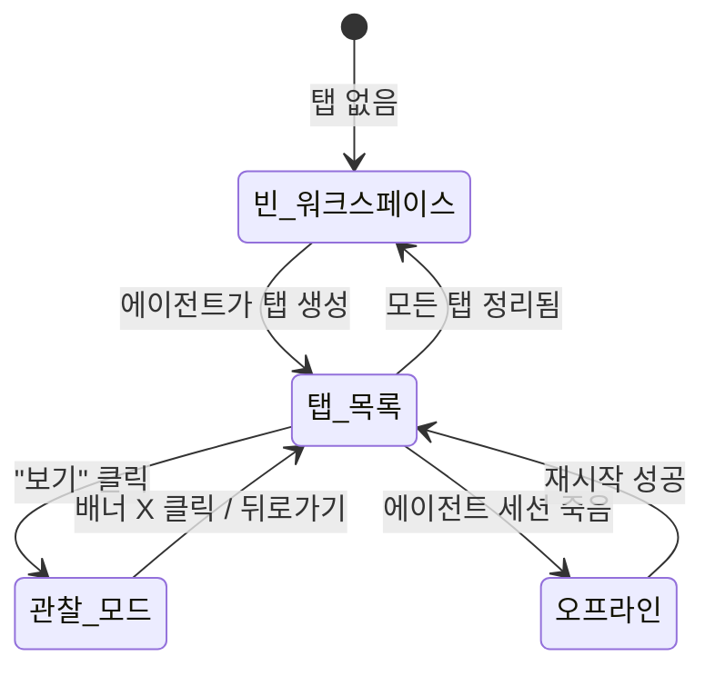

# 사용자 흐름

## 1. 워크스페이스 진입 흐름

```
1. 사용자: 에이전트 관리 또는 채팅에서 워크스페이스 탭 클릭
2. 페이지: /agents/{agentId}/workspace
3. 클라이언트: GET /api/agent/{agentId}/workspace — 탭 분포 조회
4. 활동 요약 렌더링 (실행 중/완료 카운트, 가동 시간)
5. 프로젝트별 탭 그룹 표시
6. WebSocket 연결 — 실시간 상태 갱신
```

## 2. 탭 관찰 흐름

```
1. 사용자: running 상태 탭의 "보기" 버튼 클릭
2. 해당 워크스페이스/탭으로 페이지 이동
3. 관찰 모드 배너 표시 (상단)
4. 터미널 입력 비활성화 — 에이전트 작업 방해 방지
5. 사용자: 에이전트 ↔ Claude Code 대화를 실시간 관찰
6. 사용자: 배너의 X 클릭 → 워크스페이스 페이지 복귀
```

## 3. 탭 자동 추가/제거 흐름

```
에이전트가 새 Task 시작:
  1. 에이전트: tmux로 프로젝트 워크스페이스에 탭 생성
  2. 서버: workspace:tab-added WebSocket 이벤트
  3. 클라이언트: 해당 프로젝트 그룹에 탭 항목 추가 (fade-in)
  4. 활동 요약 갱신 (실행 중 +1)

에이전트가 Task 완료 후 탭 정리:
  1. 에이전트: 탭 유지 (사용자가 결과 확인 가능)
  2. 탭 상태: running → completed (아이콘 전환)
  3. 활동 요약 갱신 (실행 중 -1, 완료 +1)
```

## 4. 에이전트 재시작 흐름

```
1. 에이전트 offline 감지 → 배너 표시
2. 사용자: "재시작" 버튼 클릭
3. API: POST /api/agent/{agentId}/restart
4. Optimistic UI: 배너 → "재시작 중..." 스피너
5. 성공:
   a. 배너 제거
   b. 에이전트 상태 → idle
   c. toast.success('에이전트가 재시작되었습니다')
6. 실패:
   a. 배너: "재시작에 실패했습니다" + 재시도 버튼
```

## 5. 상태 전이



## 6. 엣지 케이스

### 여러 프로젝트에 동시 탭

```
에이전트가 project-a, project-b, project-c에 탭 생성:
  └── 프로젝트별로 그룹화하여 표시
      └── 프로젝트 그룹은 탭 수 기준 정렬 (많은 것 먼저)
```

### 관찰 모드에서 에이전트 완료

```
관찰 중인 탭에서 에이전트 작업 완료:
  └── 관찰 모드 배너 유지 (자동 제거 안 함)
      └── 사용자가 직접 배너 닫기 또는 뒤로가기
```

### 에이전트 두뇌 세션 crash

```
에이전트의 메인 Claude Code 세션이 죽는 경우:
  └── 에이전트 상태 → offline
      └── 진행 중인 태스크 탭은 독립적으로 계속 실행
          └── 태스크 탭 완료 시 보고할 에이전트 없음
              └── 서버가 결과 저장, 에이전트 재시작 후 전달
```

### 워크스페이스 삭제

```
에이전트가 탭을 만든 워크스페이스를 사용자가 삭제:
  └── 해당 프로젝트 그룹에서 탭 제거
      └── "워크스페이스가 삭제되었습니다" 표시
```
