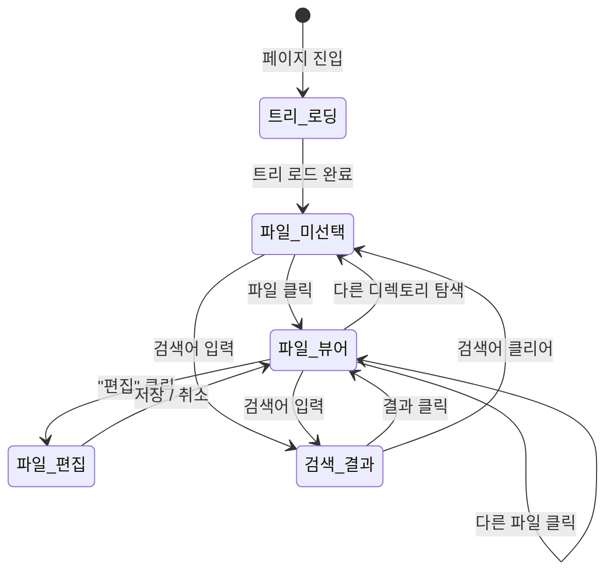

# 사용자 흐름

## 1. 메모리 탐색 흐름

```
1. 사용자: /agents/{agentId}/memory 진입
2. 클라이언트: GET /api/agent/{agentId}/memory — 트리 구조 조회
3. 좌측 트리 렌더링:
   a. 현재 에이전트 디렉토리 기본 펼침
   b. shared/ 디렉토리 기본 펼침
   c. 나머지 에이전트 디렉토리 접힘
4. 사용자: 파일 클릭
5. 클라이언트: GET /api/agent/memory/file?path={path} — 파일 내용 조회
6. 우측 패널: 마크다운 렌더링 + 파일 정보
```

## 2. 파일 편집 흐름

```
1. 사용자: 파일 뷰어에서 "편집" 버튼 클릭
2. 뷰어 → 에디터 전환 (textarea)
3. 사용자: 내용 수정
4. 사용자: "저장" 클릭
5. Optimistic UI: 에디터 → 뷰어 즉시 전환 (수정된 내용 표시)
6. API: PUT /api/agent/memory/file — 파일 저장
7. 성공: toast.success('저장되었습니다')
8. 실패: 롤백 — 에디터 모드로 복귀 + toast.error
```

## 3. 미리보기 토글 흐름

```
편집 모드에서:
  1. 사용자: "미리보기" 버튼 클릭
  2. 에디터 → split view (좌: 에디터, 우: 마크다운 렌더링)
  3. 실시간 미리보기: 에디터 입력 즉시 우측 반영
  4. 다시 "미리보기" 클릭 → 에디터 전체 화면 복귀
```

## 4. 검색 흐름

```
1. 사용자: 검색 바에 키워드 입력
2. 입력 디바운스 (300ms)
3. 클라이언트: GET /api/agent/{agentId}/memory/search?q={keyword}
4. 좌측 패널: 트리 → 검색 결과 전환
5. 결과 항목: 파일명 + 매칭 라인 미리보기 (하이라이트)
6. 사용자: 결과 클릭 → 해당 파일 뷰어로 이동
7. 검색어 클리어(X 클릭) → 트리 뷰 복귀
```

## 5. 취소 흐름

```
편집 중 취소:
  1. 사용자: "취소" 버튼 클릭
  2. 변경사항 있으면:
     a. 확인 다이얼로그: "변경사항을 버리시겠습니까?"
     b. "예" → 원래 내용으로 뷰어 복귀
     c. "아니오" → 에디터 유지
  3. 변경사항 없으면: 즉시 뷰어 복귀
```

## 6. 상태 전이



## 7. 엣지 케이스

### 편집 중 파일 변경

```
사용자가 편집 중인데 에이전트가 같은 파일을 수정:
  └── 편집 중에는 외부 변경 감지하지 않음 (last-write-wins)
      └── 저장 시 사용자 버전으로 덮어쓰기
```

### 대용량 파일

```
메모리 파일이 100KB 이상:
  └── 뷰어: 전체 렌더링 (마크다운이므로 대부분 작음)
      └── 에디터: textarea auto-resize (max-height 제한 없음, 스크롤)
```

### 파일 삭제됨

```
트리에서 파일 클릭했는데 서버에 없는 경우:
  └── 404 → "파일이 삭제되었습니다" 메시지
      └── 트리 새로고침
```

### 디렉토리 비어있음

```
에이전트의 memory/ 디렉토리가 비어있는 경우:
  └── 트리에 디렉토리는 표시, 하위 항목 없음
      └── 디렉토리 클릭 시 아무 일 없음
```

### 검색 결과 없음

```
검색어에 매칭되는 파일 없음:
  └── "검색 결과가 없습니다" 안내
```
