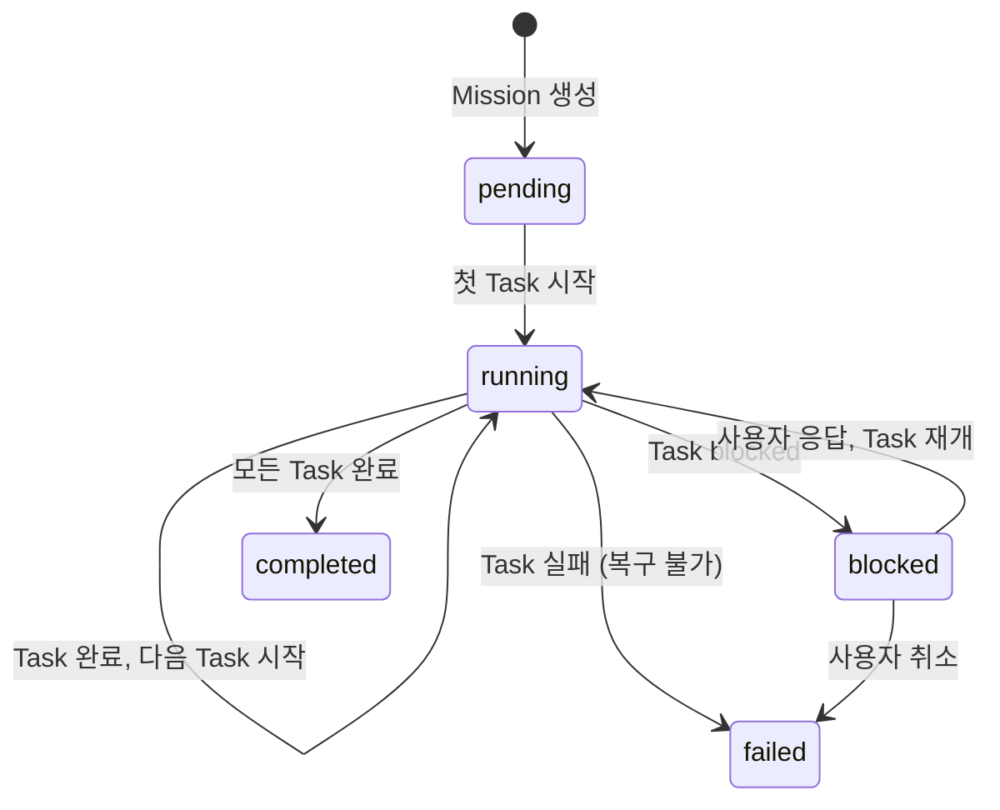
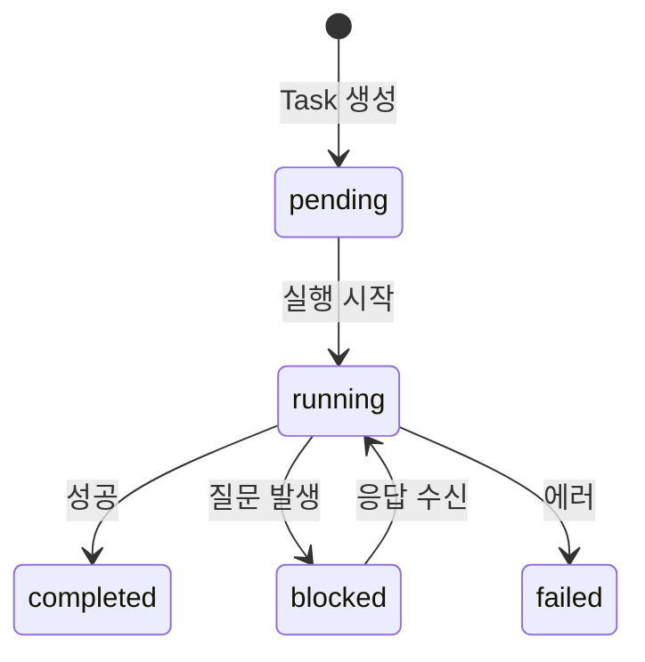

# 사용자 흐름

## 1. 미션 현황 진입 흐름

```
1. 사용자: 에이전트 채팅 또는 워크스페이스에서 미션 탭 클릭
2. 페이지: /agents/{agentId}/missions
3. 클라이언트: GET /api/agent/{agentId}/missions — 미션 목록 조회
4. 활성 미션: 트리 펼침 상태로 표시
5. 완료 미션: 아코디언 접힘
6. WebSocket 연결 — 실시간 상태 갱신 시작
```

## 2. 태스크 상태 실시간 갱신 흐름

```
1. 에이전트가 Task 실행 시작
2. 서버: mission:update WebSocket 이벤트 전송
   { missionId, taskId, status: 'running' }
3. 클라이언트: 해당 노드 아이콘 즉시 전환
   pending 빈 원 → running 펄스 닷 (부드러운 전환)
4. Task 완료 시:
   running 펄스 닷 → completed 체크마크
5. 진행률 바 실시간 업데이트:
   완료 Task 수 / 전체 Task 수
```

## 3. blocked 태스크 대응 흐름

```
1. 에이전트: question 메시지 전송 → 태스크 blocked
2. 서버: mission:update { taskId, status: 'blocked', reason: '...' }
3. 클라이언트:
   a. 해당 노드 → blocked 스타일 (주황 경고 아이콘)
   b. 미션 카드에 "🟠 1 blocked" 뱃지
4. 사용자: blocked 노드 클릭
5. 팝오버: 사유 + "채팅에서 답변하기" 버튼
6. 사용자: 버튼 클릭 → /agents/{agentId}/chat 이동
7. 채팅에서 답변 → 에이전트 재개
8. 서버: mission:update { taskId, status: 'running' }
9. 미션 대시보드: blocked → running 전환
```

## 4. 롤링 계획 변경 흐름

```
1. 에이전트: Task 1 완료 후 계획 조정
2. 서버: mission:plan-updated 이벤트
   { missionId, tasks: [...updated task list] }
3. 클라이언트:
   a. 기존 미확정 Task (점선) → 새 Task 목록으로 교체
   b. 변경된 Task에 "계획 조정됨" 라벨 표시 (3초 후 제거)
   c. 새로 추가된 Task → 등장 애니메이션 (fade-in)
   d. 삭제된 Task → 퇴장 애니메이션 (fade-out)
```

## 5. 병렬 태스크 관찰 흐름

```
1. 미션 대시보드에서 여러 Task가 running 상태
2. 각 Task 옆에 워크스페이스/탭 링크 표시
3. 사용자: 링크 클릭 → 해당 터미널 탭으로 이동
4. 사용자: 에이전트가 Claude Code와 대화하는 과정 실시간 관찰
5. 뒤로가기 → 미션 대시보드 복귀
```

## 6. 미션 완료 흐름

```
1. 마지막 Task completed
2. 서버: mission:update { missionId, status: 'completed' }
3. 클라이언트:
   a. 진행률 바 100% + text-positive
   b. 미션 상태 뱃지 → completed
   c. 3초 후 활성 미션 → 완료 미션 섹션으로 이동 (애니메이션)
```

## 7. 상태 전이



### Task 레벨 상태 전이



## 8. 엣지 케이스

### 미션 중간 진입

```
사용자가 이미 진행 중인 미션의 대시보드에 처음 진입:
  └── API 응답에 전체 트리 상태 포함
      └── 각 노드의 현재 상태대로 즉시 렌더링
```

### 대량 Task

```
Task 20개 이상인 미션:
  └── 트리 뷰가 길어짐
      └── 완료된 Task 그룹은 자동 접힘
          └── "완료된 Task (15)" 토글로 펼치기
```

### 동시 상태 변경

```
여러 Task가 거의 동시에 상태 변경:
  └── WebSocket 이벤트 순차 처리
      └── 각 변경 시 트리 부분 갱신 (전체 리렌더 방지)
```

### 미션 실패 후 재시도

```
Task 실패 시:
  └── 에이전트가 자율적으로 재시도 판단
      └── failed → pending → running (재시도)
      또는 → 사용자에게 보고 (question)
```
