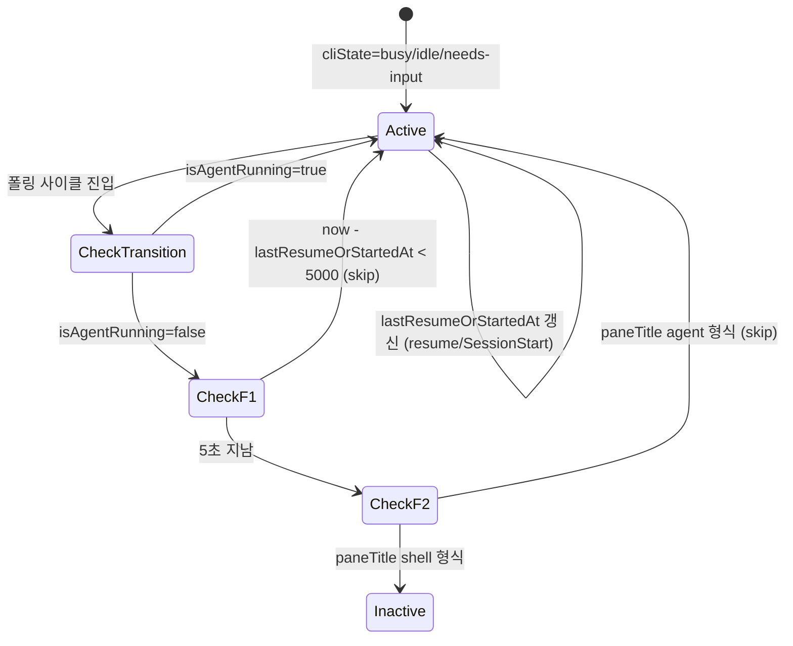

# 사용자 흐름

## 1. F1 — Recent-launch grace 흐름 (시나리오 S1)

1. 사용자 auto-resume 또는 메뉴 클릭으로 codex/claude launch
2. `auto-resume.ts`의 `sendResumeKeys` 직후: `entry.lastResumeOrStartedAt = now`
3. status-manager 다음 폴링 사이클 (30s) 진입 — 그러나 fast-tick 시나리오면 1-2초 후
4. `isAgentRunning` false (Rust binary 부팅 중)
5. F1 검사: `now - lastResumeOrStartedAt < 5000` → skip (cliState 유지)
6. 부팅 완료 후 `isAgentRunning` true → 정상 흐름 복귀

## 2. F2 — Pane title fallback 흐름 (시나리오 S2)

1. codex 정상 운영 중 (cliState='busy')
2. codex가 잠깐 자식 프로세스 fork/exec (예: tool 호출 spawn)
3. 폴링 사이클 진입 — `isAgentRunning` 폴링 그 순간만 false
4. F1 검사: 5초 지남 → fail
5. F2 검사: `paneTitle = "Working...|/path"` 또는 codex 형식 → shell 형식 아님 → skip
6. cliState 'busy' 유지 → 다음 사이클에 자연 복귀

## 3. S3 — 정상 종료 흐름

1. 사용자 codex 터미널에 `/quit` 입력 (또는 claude `/exit`)
2. process exit → shell 복귀
3. tmux `set-titles-string "#{pane_current_command}\|#{pane_current_path}"` (`tmux.conf:67-68`) 자동 발동
4. paneTitle 즉시 `zsh|/Users/.../my-project` 형식
5. 폴링 사이클 진입
6. `isAgentRunning` false
7. F1 검사: 5초 지남 → fail
8. F2 검사: paneTitle shell 형식 (`cmd|path`) → skip 안 함
9. cliState 'inactive' 정상 전환

## 4. send-keys 분리 흐름

1. 사용자 WebInputBar에 메시지 입력 + Enter
2. `sendKeysSeparated(session, message)`:
   - `tmux send-keys <session> <message>` (text만)
   - 50ms 대기
   - `tmux send-keys <session> Enter`
3. codex가 text를 input buffer에 추가 후 Enter로 submit 처리 — paste 오인 안 함

## 5. 상태 전이 — F1/F2 가드

## 6. Optimistic UI

| 액션 | 낙관적 업데이트 | 롤백 |
| --- | --- | --- |
| 메시지 송신 | WebInputBar 즉시 클리어 | send-keys 실패 시 입력 복원 + 토스트 |
| auto-resume | cliState 즉시 'busy' 가정 (Claude 패턴) | F1 grace로 inactive 회귀 차단 — 롤백 불필요 |

## 7. 엣지 케이스

| 케이스 | 처리 |
| --- | --- |
| 사용자가 종료 직후 vim 같은 alternate screen TUI 실행 | 1 polling cycle(30s) 동안 cliState='idle' 잔재 가능 — 빈도 낮아 무시. 다음 사이클에 자연 inactive |
| auto-resume 5초 안에 사용자 추가 입력 | cliState='busy'로 자연 전환 → grace 의미 무시 (정상) |
| paneTitle 완전히 비어있음 (tmux 비정상) | F2 검사: `paneTitle && ...` → false → skip 안 함 → 일반 inactive 전환 |
| `lastResumeOrStartedAt` 미설정 (legacy entry) | undefined 처리 → F1 fail → F2로 진행 |
| send-keys text가 50ms보다 오래 걸리는 paste (대용량) | tmux send-keys는 동기 호출 — 완료 후 50ms 대기 → 안전 |
| 50ms가 너무 짧아 codex가 text 처리 못 함 | 실제 코드 동작 검증 (web-input-bar.tsx 50ms 패턴 검증 완료) |
| matchesProcess args 미전달 (구 호출 사이트 누락) | TypeScript 시그니처 강제 → 컴파일 오류로 사전 차단 |

## 8. 빠른 체감 속도

- F1/F2 모두 추가 호출 0 (paneTitle은 이미 사이클 내 호출, lastResumeOrStartedAt은 메모리 read)
- send-keys 50ms 분리는 단일 메시지당 +50ms — 사용자 체감 거의 없음
- ping-pong 차단으로 인디케이터 안정 → 체감 quality ↑

## 9. 회귀 검증 시나리오

| 시나리오 | 기대 결과 |
| --- | --- |
| S1: auto-resume 직후 5초 동안 cliState 안정 | busy/idle 잔재 OK, inactive 회귀 X |
| S2: 폴링 사이클 한 번 fork/exec 흉내 (강제 polling) | 상태 흔들림 X |
| S3a: codex `/quit` → 5초 후 cliState='inactive' | 정상 전환 |
| S3b: claude `/exit` → 동일 | 정상 전환 |
| send-keys: codex 입력란에 긴 텍스트 + Enter | 줄바꿈 포함 paste 오인 X (정상 submit) |
| Store rename: 기존 Claude 패널 정상 동작 | UI 변화 없음, 기능 동일 |
