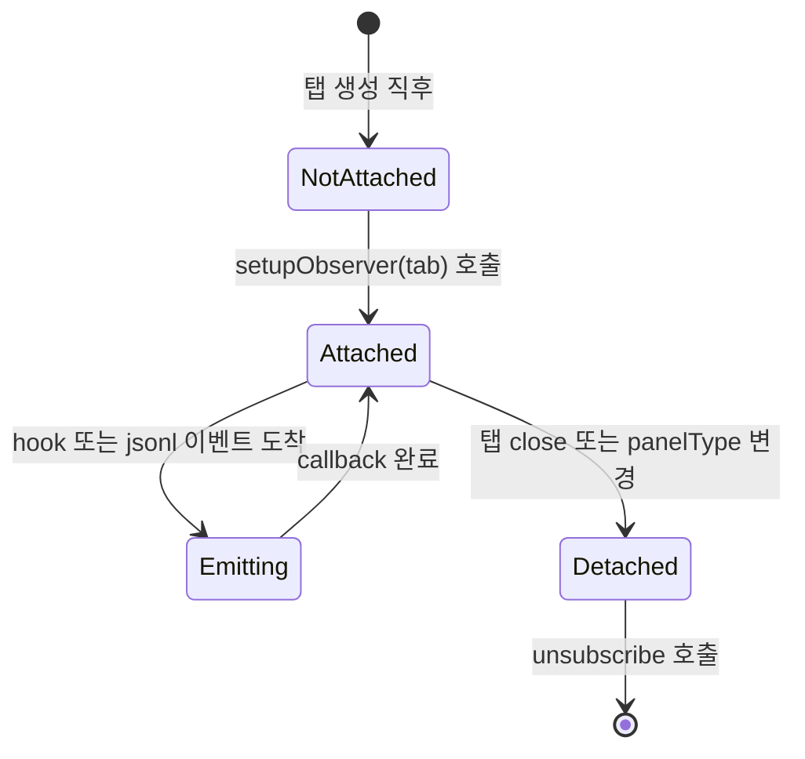

# 사용자 흐름

## 1. 마이그 전 흐름 (Phase 1~3)

```
hook 발사 → /api/status/hook endpoint
  → handleClaudeHook / handleCodexHook
    → translateXxxHookEvent helper
      → status-manager.updateTabFromHook 직접 호출
        → cliState 변경 → WebSocket push
```

```
jsonl append → timeline-server fs.watch
  → 별도 채널로 timeline-view 갱신 (status-manager 미경유)
```

## 2. 마이그 후 흐름 (Phase 4)

```
hook 발사 → /api/status/hook endpoint
  → globalThis.__pt<Provider>HookEvents.emit (단순 forward)
    ← provider observer가 listen
       → translateXxxHookEvent helper (observer 내부)
         → callback(TAgentWorkStateEvent)
           → status-manager.updateTabFromHook
             → cliState 변경 → WebSocket push
```

```
jsonl append → provider observer (jsonl tail 통합)
  → callback(TAgentWorkStateEvent — 'message-append')
    → timeline-server + status-manager 동시 알림 (단일 source)
```

## 3. attachWorkStateObserver 시그니처

```ts
interface IAgentProvider {
  // ... 기존 슬롯 ...

  attachWorkStateObserver: (
    panePid: number,
    callback: (event: TAgentWorkStateEvent) => void,
  ) => () => void;  // unsubscribe
}
```

## 4. Provider별 observer 구현

### Claude observer

1. `~/.claude/projects/<proj>/` fs.watch 시작 (기존 로직 이동)
2. `globalThis.__ptClaudeHookEvents` listen (이미 존재)
3. 두 source merge → 단일 `TAgentWorkStateEvent` stream
4. `unsubscribe`: fs.watch close + EventEmitter `off`

### Codex observer

1. `globalThis.__ptCodexHookEvents` listen 단독 (디렉토리 fs.watch 회피 — Phase 1 결정)
2. transcript_path는 hook payload에서 직접 받음
3. jsonl tail은 timeline-server가 transcript_path로 직접 watch (observer는 hook만 처리)
4. `unsubscribe`: EventEmitter `off`

## 5. status-manager 단순화

### 마이그 전

```ts
// pages/api/status/hook.ts
const handleCodexHook = async (req, res) => {
  // ... 메타 갱신 ...
  statusManager.updateTabFromHook(tmuxSession, eventName);  // 직접 호출
};
```

### 마이그 후

```ts
// pages/api/status/hook.ts
const handleCodexHook = async (req, res) => {
  // ... 메타 갱신만 ...
  globalThis.__ptCodexHookEvents.emit('hook', tmuxSession, payload);
  // status-manager 직접 호출 안 함
};

// status-manager.ts (서버 부트 시 1회)
const setupObservers = () => {
  for (const tab of allTabs) {
    if (tab.panelType !== 'claude-code' && tab.panelType !== 'codex-cli') continue;
    const provider = getProvider(tab.panelType);
    const unsubscribe = provider.attachWorkStateObserver(tab.panePid, (event) => {
      statusManager.updateTabFromObserver(tab, event);
    });
    // store unsubscribe for cleanup
  }
};
```

## 6. 상태 전이 — Observer lifecycle



## 7. Optimistic UI

본 feature는 server-side 마이그 — UI optimistic update와 무관.

## 8. 엣지 케이스

| 케이스 | 처리 |
| --- | --- |
| panelType 변경 (claude → codex) | 기존 observer unsubscribe + 새 observer attach |
| 서버 재시작 | 부트 시 모든 탭에 observer 재등록 |
| hook 폭주 (단시간 다수 이벤트) | observer 큐잉 (또는 throttle) — Phase 4에서 측정 후 결정 |
| jsonl tail 파일 삭제 (희귀) | observer가 catch + `logger.warn` + 새 파일 대기 |
| 동일 탭 양쪽 source 동시 도착 | observer가 timestamp 기준 deterministic 순서 보장 |
| observer attach 실패 (provider 미설치) | preflight에서 사전 차단 → setupObserver skip |
| EventEmitter listener leak | unsubscribe 누락 시 — 마이그 시 strict 검증 (탭 close hook에 cleanup) |

## 9. 빠른 체감 속도

- hook → observer 직결 → status-manager 단일 hop
- jsonl tail + hook 단일 채널 → 중복 fs.watch 제거
- WebSocket dispatch는 batch (50ms 윈도우) 유지

## 10. 회귀 검증 시나리오

| 시나리오 | 기대 결과 |
| --- | --- |
| Claude SessionStart / UserPromptSubmit / Stop / Notification | 모두 정상 cliState 전환 |
| Claude jsonl append → timeline 갱신 | 정상 |
| Claude busy ↔ idle 전환 (status-resilience F1/F2 영향 없음) | 정상 |
| Codex SessionStart (startup/resume/clear) source 분기 | 정상 |
| Codex PermissionRequest → permission-prompt-item 활성화 | 정상 |
| Codex /clear 시 jsonl 갈아끼우기 | timeline-server 메커니즘 정상 |
| 양쪽 탭 동시 + 한 탭 cliState 변경 → 다른 탭 영향 X | 정상 |
| 30분 stress test (hook 폭주 + jsonl append 빈번) | 메모리 누수 X, observer unsubscribe 정상 |
| 서버 재시작 → 기존 탭에 observer 재등록 | 정상 |
