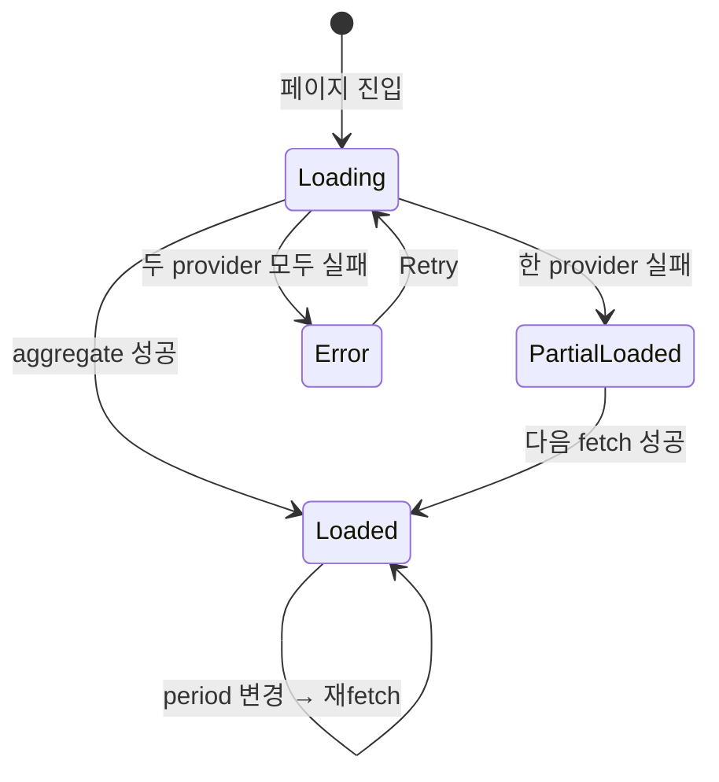

# 사용자 흐름

## 1. Stats 페이지 진입 흐름

1. 사용자 사이드바 "Stats" 클릭
2. 클라이언트: 즉시 페이지 마운트 + skeleton chart 표시
3. `aggregateStats(period)` 호출 → `Promise.all([parseClaudeJsonl, parseCodexJsonl])` 병렬
4. 응답 도착 → mergeStats → 차트 + Provider 합계 + Rate Limits 표시
5. 한 provider 실패해도 다른 provider 데이터는 graceful 표시

## 2. Notification Sheet 진입 흐름

1. 사용자 헤더 알림 아이콘 클릭 (또는 단축키)
2. Sheet 열림 + skeleton 3개
3. `loadSessionHistory()` → 메모리 캐시 또는 `~/.purplemux/session-history.json` read
4. legacy `claudeSessionId` 발견 시 lazy 마이그 (`{ agentSessionId, providerId: 'claude' }`)
5. `groupHistoryBySession` (key=`${providerId}:${agentSessionId ?? entry.id}`) → 그룹 렌더
6. 그룹 헤더에 provider 아이콘 + 토큰 표시

## 3. 세션 클릭 → 해당 timeline 열기

1. 사용자 알림 항목 클릭
2. `providerId`로 분기:
   - Claude → Claude 패널로 전환 + 해당 jsonlPath timeline 마운트
   - Codex → Codex 패널로 전환 + 동일
3. 같은 워크스페이스가 아니면 → 워크스페이스 전환 + 패널 마운트

## 4. ContextRing 갱신 흐름 — Codex

1. codex 세션 진행 중 → `event_msg.token_count` 라인 추가 (codex가 주기적 발사)
2. 파서가 token_count 정보 추출 → `ISessionStats.totalTokens` 갱신
3. WebSocket `session-stats:updated` push
4. ContextRing이 `used / model_context_window` 비율로 회전
5. `reasoning_output_tokens` 별도 표시 (옵션 footer)

## 5. /clear 후 ContextRing reset

1. SessionStart hook (`source: 'clear'`) → 새 sessionId
2. timeline-server가 `timeline:session-changed` 발사
3. 클라이언트 sessionStats reset → ContextRing 0%로 갱신
4. 새 turn 진행 → 토큰 점진 증가

## 6. session-history 마이그 흐름 (lazy)

1. 서버 부트 시 `~/.purplemux/session-history.json` read
2. 각 entry 검사:
   - `agentSessionId` 있음 → 그대로
   - `claudeSessionId` 있음 + `agentSessionId` 없음 → `{ agentSessionId: claudeSessionId, providerId: 'claude' }`로 마이그 (메모리만 — 디스크는 다음 write 시 새 형식)
3. `claudeSessionId` 필드는 deprecated 마크 (logger.info 1회)
4. 이후 모든 처리는 `agentSessionId` + `providerId` 사용

## 7. 상태 전이 — Stats 페이지

## 8. Optimistic UI

| 액션 | 낙관적 업데이트 | 롤백 |
| --- | --- | --- |
| Period selector 변경 | 즉시 skeleton + 새 fetch | 실패 시 이전 데이터 + 토스트 |
| Notification 항목 클릭 | 즉시 sheet 닫힘 + 패널 전환 | timeline 마운트 실패 시 토스트 |
| Stats 페이지 prefetch | 메뉴 hover 시 워밍 | N/A |

## 9. 엣지 케이스

| 케이스 | 처리 |
| --- | --- |
| Codex 디렉토리 미존재 (codex 첫 사용 전) | `parseCodexJsonl`이 빈 결과 반환 → Claude 단독 표시 |
| 매우 큰 jsonl (수백 MB) | 토큰만 추출 (전체 파싱 안 함) — 역방향 스캔 |
| period 30일 초과 | UI에서 30일 제한 (예정 작업: 길이 옵션) |
| legacy session-history.json 손상 | catch + 빈 상태 + `logger.error` |
| session-meta-cache 키 충돌 (`${providerId}:${sessionId}`) | provider prefix로 충돌 회피 — 발생 안 함 |
| 한 provider만 사용 (예: Codex만) | 차트는 단일 색, 합계 카드는 다른 provider "사용 내역 없음" |
| Rate Limits Codex만 (Claude는 해당 필드 없음) | 조건부 렌더 — Claude는 섹션 hidden |
| ContextRing 모델 다른 (예: gpt-5-codex 200k vs claude 200k) | 각 provider별 model_context_window 사용 |
| 차트 데이터 0 | "이 기간에 세션이 없습니다" + Period selector |
| 모바일 가로 회전 시 차트 잘림 | 가로 스크롤 |

## 10. 빠른 체감 속도

- `Promise.all` 병렬 → 두 provider 합산 시간 = max(claude, codex)
- 통계 페이지 prefetch (메뉴 hover 시 워밍)
- session-meta-cache → 같은 jsonl 재read 회피
- 디렉토리 스캔 30일 한도
- notification-sheet 가상 스크롤 (이미 적용)
- mergeStats는 메모리 연산 — 비용 무시
- 토큰 추출은 codex jsonl 마지막 `token_count` 역방향 스캔 → 첫 hit (전체 read 회피)

## 11. UX 완성도 — 토스급

- **빠르다**: 병렬 호출 + prefetch + 가상 스크롤
- **로딩/빈/에러**: 모두 명시 (skeleton, "없음", graceful degradation)
- **인터랙션**: 차트 hover tooltip, 항목 클릭 즉시 전환
- **provider 시각 구분**: 모든 곳에서 일관 (아이콘 + 색상 + 라벨)
- **graceful degradation**: 한 provider 실패해도 다른 provider 데이터는 표시
- **마이그 부드러움**: legacy entry는 lazy 변환 — 사용자 인지 없이 자연 갱신

## 12. 회귀 검증 시나리오

| 시나리오 | 기대 결과 |
| --- | --- |
| Claude 단독 환경 | 차트/카드 정상, Codex "사용 내역 없음" |
| Codex 단독 환경 | 차트/카드 정상, Claude "사용 내역 없음" |
| 양쪽 합산 | 차트 stacked 정상 표시 |
| Codex Rate Limits 노출 | Claude는 섹션 hidden |
| ContextRing Codex 세션 | `model_context_window` 기준 정상 |
| ContextRing /clear 후 | 0%로 reset |
| Notification sheet legacy entry | 자연 마이그, provider 아이콘 정상 |
| Notification sheet 항목 클릭 | provider 분기로 정확한 패널 전환 |
| Period selector 변경 | 새 데이터 fetch |
| 한 provider 실패 (예: Codex 디렉토리 권한) | 다른 provider 데이터는 정상 표시 + 토스트 |
| 큰 jsonl (수백 MB) | 토큰 추출 빠름 (역방향 스캔) |
| 모바일 stats 페이지 | 1열 stack + 가로 스크롤 차트 |
