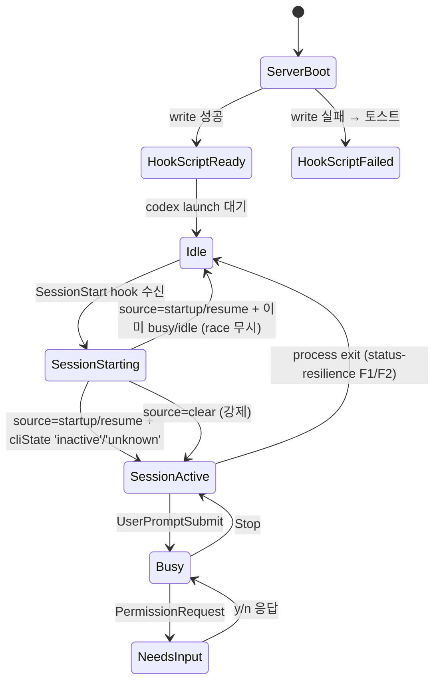

# 사용자 흐름

## 1. 서버 부트 시 hook script 설치

1. 서버 시작 (`server.ts`)
2. `~/.purplemux/codex-hook.sh` 존재 확인
3. 미존재 또는 내용 다름 → write (mode 0700)
4. write 실패 → `logger.error('codex-hook write failed')` + 다음 SyncServer push에 시스템 토스트 큐 추가
5. write 성공 → silent (정상 동작)

## 2. Codex 탭 launch 시 hook 머지

1. 사용자 "Codex 새 대화" 클릭
2. `providers/codex/hook-config.ts`가:
   - `~/.codex/config.toml` read (graceful — 미존재 OK)
   - 파싱 (TOML)
   - `[...ourEntries, ...userEntries]` merge — display_order로 deterministic 출력
3. `-c hooks.SessionStart=[...]`, `-c hooks.UserPromptSubmit=[...]`, `-c hooks.Stop=[...]`, `-c hooks.PermissionRequest=[...]` 4 인자 빌드
4. `logger.info('codex hooks merged: N user entries')` 디버깅 보조
5. `codex` 실행 → hook 시스템 활성화

## 3. Hook 이벤트 lifecycle (SessionStart 예시)

1. codex 본체에서 SessionStart 이벤트 발생
2. dispatcher가 `[...ourEntries, ...userEntries]` 모든 hook을 `join_all` 병렬 실행 (각 별 프로세스 + stdin 격리)
3. 우리 hook script `~/.purplemux/codex-hook.sh` 실행:
   - `tmux display-message -p '#S'`로 tmux session 추출
   - stdin payload (`{ session_id, hook_event_name, source, transcript_path, ... }`)을 그대로 forward
   - `curl -X POST -H "x-pmux-token: <token>" -H "Content-Type: application/json" -d @- "http://localhost:${PORT}/api/status/hook?provider=codex&tmuxSession=<session>"`
4. 서버: `pages/api/status/hook.ts`가 query param으로 분기:
   - `provider=codex` → `handleCodexHook(req, res)`
   - `provider` 없음 → `handleClaudeHook` (default)
5. `handleCodexHook`이 payload 파싱:
   - `entry.agentProviderId = 'codex'`
   - `entry.agentSessionId = payload.session_id`
   - `entry.jsonlPath = payload.transcript_path` (null guard)
   - `source` 필드로 startup/resume/clear 분기
6. `globalThis.__ptCodexHookEvents.emit('session-info', ...)` → codex provider `watchSessions`가 listen
7. timeline-server가 jsonl 파일 unsubscribe → 새 파일 subscribe → `timeline:session-changed` 발사 → 클라이언트 reset

## 4. /clear 처리 (source: 'clear')

1. 사용자 codex 터미널에 `/clear` 입력
2. codex가 새 sessionId로 갈아끼움 + SessionStart hook 발사 (`source: 'clear'`)
3. 서버:
   - `entry.agentSummary = null`
   - `entry.lastUserMessage = null`
   - `entry.lastAssistantMessage = null`
   - `statusManager.updateTabFromHook(tmuxSession, 'session-start')` 강제 호출 (race 없음)
4. timeline 클라이언트가 `timeline:session-changed` 수신 → 빈 timeline + ContextRing 0%로 reset

## 5. 상태 전이

## 6. Optimistic UI

| 액션 | 낙관적 업데이트 | 롤백 |
| --- | --- | --- |
| Codex 탭 launch | 즉시 패널 마운트 + cliState='inactive' 표시 | hook 등록 실패 = N/A (사용자 config 영향만) |
| /clear | UI는 hook 도착 후에만 reset (낙관적 적용 안 함 — race 위험) | N/A |
| 메시지 송신 | WebInputBar 즉시 클리어 + 임시 user-message timeline 추가 | hook UserPromptSubmit 도착 시 실제 entry로 교체 |

## 7. 엣지 케이스

| 케이스 | 처리 |
| --- | --- |
| 사용자 hook이 stdin을 소비해버림 | 우리 hook은 별 프로세스 + 별 stdin → 영향 없음 (`join_all` 병렬) |
| 사용자 hook이 매우 느림 (timeout 안에서) | codex 본체 진행 지연 — 우리 책임 밖, caveat 문서화 |
| `tmux display-message` 실패 (session 없음) | curl URL에 `tmuxSession=` 빈 값 → 서버 400 응답 + `logger.warn` |
| `~/.codex/config.toml` BOM/주석 등 비정상 형식 | TOML 파서가 graceful → 우리 entry만 적용 + C 토스트 |
| codex가 `transcript_path` null 반환 (이론상) | jsonlPath 갱신 skip + 메타 보존 (race 시나리오) |
| 사용자가 hook script 직접 수정 | 다음 부트에 덮어씀 (auto-managed file) |
| 서버 부트 직후 hook 발사 (race) | hook은 토큰 검증 통과 — 단 서버 ready 전이면 connection refused → codex 측 hook 실패 (codex 본체엔 영향 없음) |
| 토큰 변경 후 codex 본체는 그대로 (이전 토큰 캐시 안 함) | hook script가 매번 `~/.purplemux/cli-token` read → 자동 동기화 |

## 8. 빠른 체감 속도

- hook script는 부트 직후 1회 write — 매 launch 비용 0
- 사용자 config 파싱 결과 캐시 (file mtime watch — 변경 감지 시 재파싱)
- `tmux display-message` ~10ms + `curl POST localhost` ~5ms → hook 한 사이클 < 50ms (codex 본체 await에 부담 없음)
