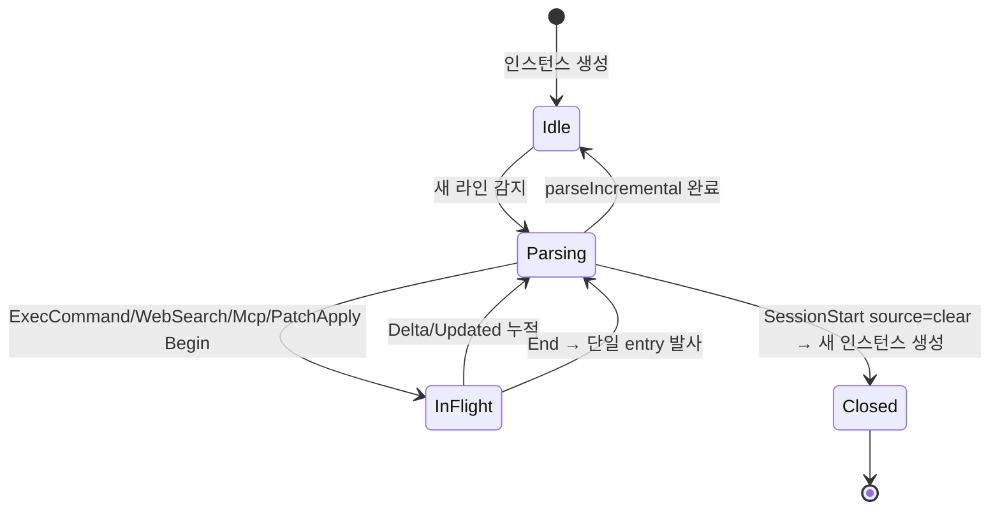

# 사용자 흐름

## 1. Codex 세션 시작 → 파서 인스턴스 생성

1. timeline-server가 `globalThis.__ptCodexHookEvents` listen
2. SessionStart hook 도착 → `transcript_path` 추출
3. 새 `CodexParser` 인스턴스 생성 (`{ jsonlPath, inFlight: new Map() }`)
4. 파일 fs.watch 시작 (또는 polling tail) → 라인 추가 시 `parseIncremental` 호출
5. 빈 파일 → 빈 `ITimelineEntry[]` 발사 (timeline-view에 변화 없음)

## 2. 일반 turn 흐름 (reasoning + tool-call + agent-message)

1. 사용자 메시지 입력 → codex가 `event_msg.user_message` 라인 append
2. 파서: `user-message` entry 발사 → 클라이언트 `timeline:append`
3. codex가 reasoning 시작 → `response_item.reasoning` 라인 append (encrypted_content + summary)
4. 파서: `reasoning-summary` entry 발사 (summary[]만 표시, encrypted_content 미해독)
5. codex가 tool 호출 → `response_item.function_call` 라인 append
6. 파서: `tool-call` entry 발사 (id ↔ call_id 매핑)
7. tool 결과 → `response_item.function_call_output` 라인 append
8. 파서: `tool-result` entry 발사 (toolUseId 매칭)
9. codex가 답변 → `event_msg.agent_message` 라인 append
10. 파서: `assistant-message` entry 발사 (usage undefined — Codex는 라인 자체에 token 없음)
11. turn 종료 → `event_msg.TurnComplete` 라인 append
12. 파서: `turn-end` entry 발사

## 3. ExecCommand stream 흐름 (in-flight tracking)

1. codex가 shell 명령 실행 시작 → `ExecCommandBegin(call_id, command)` 라인
2. 파서: in-flight Map에 `call_id` 키로 `{ command, stdoutBuffer: '' }` 저장 — entry 발사 안 함
3. stdout chunk 도착 → `Delta(call_id, chunk)` 라인 (여러 번)
4. 파서: `inFlight.get(call_id).stdoutBuffer += chunk` — entry 발사 안 함
5. 명령 종료 → `End(call_id, exit_code)` 라인
6. 파서: `inFlight.get(call_id)` 꺼냄 + 단일 `exec-command-stream` entry 발사
7. in-flight Map에서 `call_id` 삭제

### WebSearch / McpToolCall (단순 Begin/End)

1. `Begin(call_id)` → in-flight Map 저장
2. `End(call_id, result)` → 단일 entry 발사 + Map 삭제

### PatchApply (Begin/Updated/End)

1. `Begin(call_id)` → in-flight Map에 `{ files: [] }` 저장
2. `Updated(call_id, file)` 여러 번 → `inFlight.get(call_id).files.push(file)`
3. `End(call_id, success)` → 단일 `patch-apply` entry 발사

## 4. /clear 후 흐름

1. 사용자 `/clear` 입력
2. codex가 새 sessionId + 새 jsonl 파일 (`source: 'clear'` SessionStart hook)
3. timeline-server가 hook 채널로 알림 받음 → 기존 파서 인스턴스 정리
4. 새 jsonl 경로로 새 파서 인스턴스 생성 (in-flight Map 빈 상태)
5. 클라이언트는 `timeline:session-changed` 수신 → timeline 클리어
6. 새 라인부터 파싱

## 5. Resume 흐름

1. 사용자 codex 세션 목록에서 클릭 → `codex resume <id>` 실행
2. codex가 기존 jsonl 파일 다시 read (append-only이므로 라인 보존)
3. timeline-server가 새 SessionStart hook 받음 → 동일 jsonl path
4. 파서: 기존 인스턴스가 이미 모든 라인 처리 완료 — 새 라인만 처리 (incremental)
5. 사용자가 추가 메시지 → 새 라인 append → 파서 정상 발사

## 6. 상태 전이 — 파서 인스턴스 lifecycle

## 7. Optimistic UI (timeline 측)

| 액션 | 낙관적 업데이트 | 롤백 |
| --- | --- | --- |
| 사용자 메시지 송신 | WebInputBar 즉시 클리어 + 임시 user-message entry 추가 (id='temp-...') | jsonl 라인 도착 → 실제 entry로 교체 (id 재할당) |
| 파서 실패 | 임시 entry 그대로 유지 + 다음 사이클 재시도 | jsonl 라인 도착 후 정상 교체 |

## 8. 엣지 케이스

| 케이스 | 처리 |
| --- | --- |
| Begin 후 End 영구 미도착 (codex crash) | 다음 turn 시작 시 stale in-flight 정리 + `error-notice` 발사 |
| Delta가 매우 큰 stdout (~MB) | stdoutBuffer 메모리 사용 ↑ — 한도(예: 1MB) 초과 시 truncate + "[... truncated]" 표시 |
| jsonl 파일 중간이 손상된 라인 | 해당 라인 skip + `logger.warn` (dedup) — 다음 라인부터 정상 |
| 파일 watch 실패 (fs.watch limit) | polling fallback (1초 interval) |
| 같은 call_id 재사용 (codex 버그 가능성) | 새 Begin이 들어오면 기존 in-flight overwrite + `logger.warn` |
| `assistant-message`에 usage 필드 기대하는 기존 코드 | `usage?: TUsage` optional 처리 — Codex는 undefined OK |
| 매우 긴 reasoning summary[] | 표시 시 expand/collapse 토글 (`reasoning-summary-item`이 처리) |

## 9. 빠른 체감 속도

- incremental 파싱: 마지막 처리 offset 기억 → 새 라인만 read (전체 파일 재read 회피)
- in-flight Map은 메모리 — Begin/Delta/End 매칭 O(1)
- 파서 인스턴스는 jsonl당 1개 → 여러 codex 탭 동시 운영도 부담 없음
- WebSocket dispatch는 batch (50ms 윈도우) — 라인 폭주 시 묶어서 발사

## 10. 회귀 검증 시나리오

| 시나리오 | 기대 결과 |
| --- | --- |
| 풀 turn (reasoning + tool + message) | 모든 entry 정상 표시 |
| ExecCommand 긴 stdout | `exec-command-stream` 단일 entry + collapsed/expanded 토글 |
| WebSearch 호출 + 결과 | `web-search` 단일 entry + 결과 요약 |
| MCP tool 호출 | `mcp-tool-call` 단일 entry + server 이름 |
| PatchApply multi-file | `patch-apply` 단일 entry + diff 표시 |
| approval-request 각 종류 | 종류별 시각 분기 정상 |
| error-notice 4 severity | 색상/아이콘/배지 정상 분기 |
| /clear 후 in-flight Map reset | 새 인스턴스에서 빈 Map 시작 |
| Begin 후 End 누락 (강제 codex kill) | stale 처리 + error-notice 발사 |
