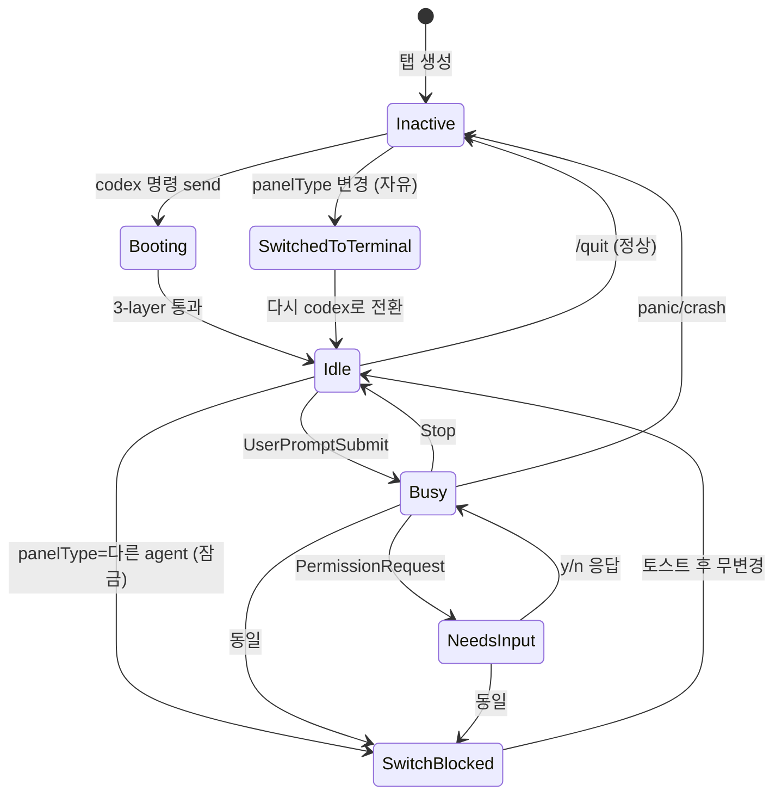

# 사용자 흐름

## 1. Codex 새 대화 시작

1. 사용자 메뉴 또는 `Cmd+Shift+X` → "Codex 새 대화"
2. 서버: 새 탭 생성 + tmux session + `panelType: 'codex-cli'`
3. 클라이언트: 즉시 패널 마운트 + cliState='inactive' + Start 버튼 표시
4. 사용자 Start 클릭 (또는 자동 launch 옵션)
5. `codex` send-keys → boot indicator 진입
6. 3-layer 통과 → cliState='idle' → WebInputBar 활성

## 2. 단축키 `Cmd+Shift+X` 누름

1. 현재 탭의 panelType 검사:
   - `codex-cli` → no-op
   - `terminal/diff/web-browser` → 즉시 `codex-cli` 전환 (CLI 안 죽임, display만)
   - `claude-code` + cliState busy/idle/... → 잠금 토스트 표시 + 거부
   - `claude-code` + cliState inactive/unknown → 즉시 전환
2. 전환 시 `agentState` 덮어쓰기 (Codex 신규 session 시작 — legacy fallback 없음)

## 3. Provider 전환 흐름 (잠금 매트릭스)

### 시나리오 A — Terminal → Codex (자유)

1. 사용자 단축키 또는 panel selector
2. cliState 확인 무관 — terminal CLI는 안 죽임
3. 즉시 panelType 변경 + 패널 마운트
4. terminal 탭의 shell은 background에서 살아있음 (다시 전환 시 그대로)

### 시나리오 B — Claude (busy) → Codex (차단)

1. 사용자 panel selector에서 Codex 선택
2. cliState='busy' && currentIsAgent && targetIsAgent → 차단
3. 토스트 (`switchAgentBlocked`) 표시: "Claude이 실행 중입니다. 터미널에서 /exit으로 종료 후 다시 시도하세요"
4. panelType 변경 안 함 (사용자 의도 보호)
5. 사용자 터미널에서 `/exit` 입력 → cliState='inactive' → 다시 시도 가능

### 시나리오 C — Claude (inactive) → Codex (자유)

1. Claude 종료된 상태
2. 즉시 전환
3. agentState 덮어쓰기 (Claude 메타 → Codex 메타)
4. Claude는 `claude*` legacy fallback 있음 → 다음 Claude launch 시 자연 resume 가능
5. Codex는 legacy 없음 → 새 session

## 4. Restart 흐름 (헤더 ⋮ 메뉴)

1. 사용자 ⋮ → "Restart" 클릭
2. 확인 dialog: "현재 세션을 종료하고 새로 시작합니다. 진행할까요?"
3. 확인 → tmux send-keys `<C-c>` (또는 process kill) + `codex` 새 launch
4. cliState='inactive' → boot indicator → idle

## 5. Quit 흐름

1. 사용자 ⋮ → "Quit"
2. tmux send-keys `/quit\n` (codex의 quit command)
3. codex process exit → shell 복귀
4. status-resilience F2 통과 안 함 → cliState='inactive'
5. 패널은 빈 상태 + Start 버튼

## 6. 상태 전이 — 잠금 매트릭스 시각

## 7. Optimistic UI

| 액션 | 낙관적 업데이트 | 롤백 |
| --- | --- | --- |
| 새 Codex 탭 생성 | 즉시 탭 추가 + 패널 마운트 | tmux session 실패 시 탭 제거 + 토스트 |
| Provider 전환 (자유 케이스) | 즉시 panelType 변경 | 잠금 위반은 사전 검사 (롤백 없음) |
| Start 버튼 클릭 | 즉시 boot indicator | send-keys 실패 시 빈 상태 복귀 + 토스트 D |
| Restart | 즉시 confirm dialog | 사용자 cancel 시 변화 없음 |
| 메시지 송신 | WebInputBar 즉시 클리어 + 임시 timeline entry | hook 도착 시 실제 entry 교체 |

## 8. 엣지 케이스

| 케이스 | 처리 |
| --- | --- |
| 빠른 단축키 연타 (`Cmd+Shift+X` 두 번) | 두 번째는 no-op (이미 codex panelType) |
| 사용자가 panel selector 클릭 직후 cliState 전환 (race) | 클릭 시점 cliState로 검사 — 1 frame 차이는 사용자 의도 우선 |
| Restart 중 사용자 메시지 입력 | WebInputBar는 boot 동안 disabled — 시각적으로 명확 |
| 다른 탭에서 동일 워크스페이스의 codex 탭 생성 | 각 탭 독립 — 잠금 무관 |
| panelType 전환 후 즉시 다시 Codex로 (codex 죽지 않음) | terminal로 전환 후 다시 codex → 동일 세션 그대로 보임 (process 안 죽임) |
| 단축키 cheatsheet 보고 처음 `Cmd+Shift+X` 사용 | 잘 안내 — `⋮` 메뉴 우측에 단축키 표시 |
| `agentInstalled: false` 상태에서 `Cmd+Shift+X` | 단축키 처리 시점에 검사 → 토스트 (A) `codexNotInstalled` 표시 |
| 모바일에서 단축키 미지원 | 메뉴/탭바로 전환 가능 — 기능 동등 |

## 9. 빠른 체감 속도

- panel 컴포넌트 lazy import (`React.lazy`) — 첫 진입 시만 비용
- 탭 prefetch: 메뉴 hover 시 import 트리거
- 빈 상태 마지막 세션 미리보기는 `listCodexSessions` 결과 첫 1개만 — 가벼움
- 잠금 검사는 store read만 — 비동기 호출 없음
- panelType 전환은 store update + React 재렌더 — < 16ms

## 10. UX 완성도 — 토스급

- 권한 요청 도착 시:
  - 헤더 인디케이터 색상 즉시 파란 + 깜박임 (`animate-pulse`)
  - 패널 자체에서도 권한 요청 카드 강조 표시 (페인 타이틀 외에)
  - 알림음 옵션 (사용자 설정, 기본 off)
- 상태 전환 애니메이션 일관성 (Claude와 동일 200ms ease-out)
- 빈 상태에 마지막 사용 세션 미리보기로 "다시 시작" 가속화

## 11. 회귀 검증 시나리오

| 시나리오 | 기대 결과 |
| --- | --- |
| Codex 새 대화 (메뉴) | 정상 launch |
| `Cmd+Shift+X` (terminal에서) | Codex 패널 즉시 마운트 |
| `Cmd+Shift+X` (Claude busy 상태) | 잠금 토스트 + 거부 |
| `Cmd+Shift+X` (Claude inactive 상태) | 즉시 전환 + agentState 덮어쓰기 |
| Provider 전환 후 다시 원래 | terminal/diff는 process 그대로 / Claude는 legacy resume / Codex는 새 session |
| Restart 중 메시지 입력 시도 | WebInputBar disabled |
| `agentInstalled: false` | Install 가이드 빈 상태 + 단축키 누르면 토스트 A |
| 모바일에서 panel 전환 | 탭바 또는 메뉴로 동일 동작 |
| 잠금 토스트 후 사용자 `/exit` → 재시도 | 정상 전환 |
