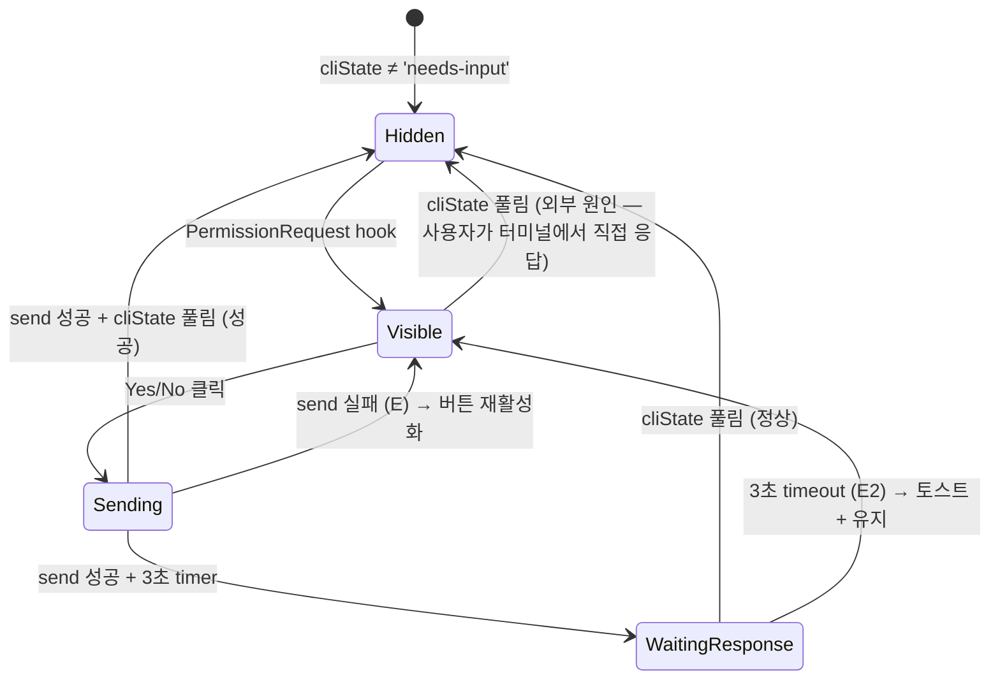

# 사용자 흐름

## 1. 권한 요청 도착 → UI 활성화

1. codex가 PermissionRequest hook 발사 (예: `ExecApprovalRequest`)
2. `~/.purplemux/codex-hook.sh` → `/api/status/hook?provider=codex`
3. `handleCodexHook`이 `cliState='needs-input'` 전환 + `currentAction` 설정
4. tmux pane title: `[ ! ] Action Required` (기존 메커니즘)
5. 클라이언트: cliState 변경 수신 → `<PermissionPromptCard />` 마운트
6. 카드 slide-down (200ms) + 깜박임 시작
7. 패널 헤더 인디케이터 파란 + `animate-pulse`

## 2. 사용자 Yes 클릭 흐름

1. 사용자 Yes 버튼 클릭 (또는 `y` 키 누름)
2. UI: 두 버튼 즉시 disabled + spinner
3. `tmux send-keys <session> y` (단일 글자, Enter 불필요)
4. 3초 timeout timer 시작
5. send 성공 → 응답 대기
6. codex가 처리 → cliState='needs-input' 풀림 (`Stop` 또는 `UserPromptSubmit` hook)
7. 클라이언트: cliState 수신 → 카드 fade-out + 토스트 "권한 부여됨"
8. timer cleared

## 3. 사용자 No 클릭 흐름

동일 흐름, `n` 송신.

## 4. 키보드 단축 흐름

1. 패널 포커스 상태 + cliState='needs-input'
2. 사용자 `y` 키 누름
3. `useKeyboardShortcut` 등록된 핸들러가 Yes 클릭과 동일 동작 트리거
4. 동일 송신 흐름

`n`/`Esc`도 동일.

## 5. 송신 실패 흐름 (E)

1. 사용자 Yes 클릭
2. `tmux send-keys` throw (tmux 비정상)
3. catch + `notifyCodexApprovalSendFailed()` 토스트 표시
4. UI: 버튼 재활성화 (사용자가 재시도 가능)
5. timer 시작 안 함

## 6. Timeout fallback 흐름 (E2)

1. 사용자 Yes 클릭 → send 성공 → timer 시작 (3초)
2. 3초 경과 → cliState 여전히 'needs-input'
3. `notifyCodexApprovalNotApplied(retry)` 토스트 표시
4. 카드는 유지 — 사용자가 재시도 가능
5. 사용자 토스트의 "재시도" 클릭 → 다시 송신
6. 또는 keymap 확인 후 다른 키로 응답

## 7. 자세히 보기 토글 흐름

1. 사용자 "자세히 보기" 클릭 (또는 `e` 키)
2. height transition (200ms ease-out)
3. expanded → command/diff/permissions 전체 표시
4. 다시 클릭 → collapsed (200ms reverse)

## 8. 상태 전이

## 9. Optimistic UI

| 액션 | 낙관적 업데이트 | 롤백 |
| --- | --- | --- |
| Yes/No 클릭 | 즉시 spinner + 버튼 disabled | send 실패 (E) → 토스트 + 버튼 재활성화 |
| 응답 처리 | (낙관적 적용 안 함 — race 위험) | N/A |
| 카드 fade-out | 응답 성공 후만 (낙관적 X) | N/A |

응답 성공/실패는 codex 본체가 결정 — 낙관적 적용 안 하고 실제 cliState 변경 대기.

## 10. 엣지 케이스

| 케이스 | 처리 |
| --- | --- |
| 사용자 키보드 단축 + 마우스 동시 | 첫 트리거만 처리 (isSending 가드) |
| 매우 긴 command (1000+ chars) | 자세히 보기 collapsed default — 노이즈 방지 |
| diff가 매우 큰 patch (수백 줄) | diff preview는 max-height + 스크롤 |
| 권한 요청 도착 직후 사용자가 다른 탭으로 | 페인 타이틀 알림 + 다음 진입 시 카드 그대로 |
| codex가 권한 요청 무효화 (timeout 등 — 자체 정책) | hook으로 cliState 풀림 → 카드 자동 fade-out |
| 사용자가 터미널에서 직접 `y`/`n` 입력 | hook으로 cliState 풀림 → 카드 자동 fade-out |
| 동시 다발 권한 요청 (병렬 turn — 희귀) | 큐잉 — 순서대로 카드 표시 (한 번에 1개) |
| sendKeys 분리 50ms 패턴 적용 안 함 (단일 글자) | y/n은 단일 글자라 atomic — 50ms 분리 불필요 |
| 사용자 keymap 변경 (`y`→`x` 등) | E2 토스트 fallback으로 사용자 인지 유도. 정식 동적 인지는 예정 작업 |
| 카드 표시 중 panelType 전환 시도 | 잠금 매트릭스에 의해 차단 (`codex-panel-ui`) |

## 11. 빠른 체감 속도

- send-keys는 ~10ms — 사용자 클릭 즉시 송신
- spinner 표시는 React 다음 frame (16ms 이내)
- cliState 변경 수신 → 즉시 카드 fade-out (WebSocket push)
- 자세히 보기 toggle는 client-side만 (서버 호출 없음)

## 12. UX 완성도 — 토스급

- **즉각적 visual cue**: 카드 + 깜박임 + 페인 타이틀 + 헤더 인디케이터 (4중)
- **명확한 컨텍스트**: request 종류별 메시지 + 대상 정보 + 자세히 보기
- **빠른 응답 경로**: 키보드 단축 (`y`/`n`/`Esc`)
- **실패 복구**: 토스트 (E) + 재시도 버튼 + Timeout fallback (E2) 안내
- **노이즈 차단**: 자세히 보기 default collapsed — 한 줄 메시지로 핵심 전달

## 13. 회귀 검증 시나리오

| 시나리오 | 기대 결과 |
| --- | --- |
| ExecApproval 도착 → Yes 응답 | 카드 표시 + 송신 + cliState 풀림 + fade-out |
| 동일 → No 응답 | 동일, 토스트 "권한 거부됨" |
| 송신 실패 (tmux 비정상) | 토스트 E + 버튼 재활성화 |
| 송신 성공 후 3초 무응답 | 토스트 E2 + 카드 유지 |
| 사용자 키보드 `y` 단축 | Yes 클릭과 동일 동작 |
| ApplyPatchApproval (multi-file) | 파일 목록 표시 + 자세히 보기 시 diff |
| RequestPermissions | 권한 목록 표시 |
| 사용자가 터미널에서 직접 `y` 입력 | 카드 자동 fade-out |
| panelType 전환 시도 (cliState='needs-input') | 잠금 토스트 + 거부 |
| 매우 긴 command/diff | 노이즈 없이 표시 (자세히 보기 collapsed) |
| 모바일 터치 | Yes/No 버튼 `min-h-12` 정상 |
| 권한 요청 carousel (연속) | 큐잉 후 순서대로 표시 |
