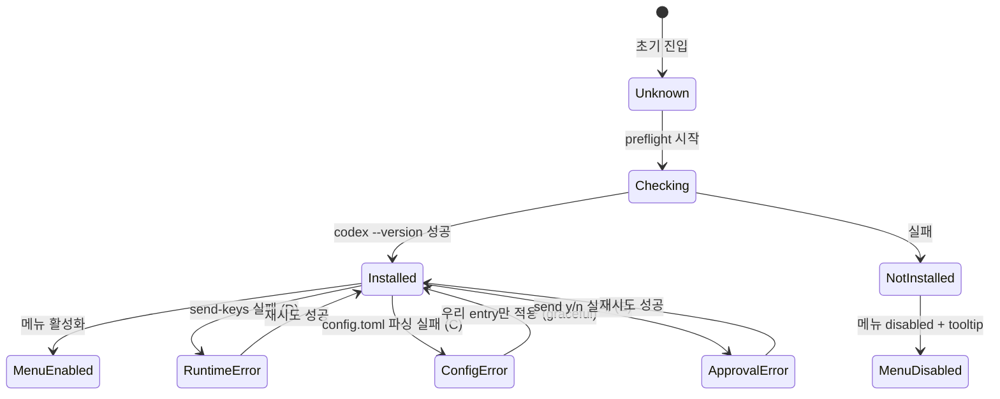

# 사용자 흐름

## 1. 정상 — Codex 설치 환경

1. 사용자 첫 진입 (서버 부트 후)
2. preflight 페이지 자동 실행: `codex --version` → installed: true, version: "0.x.x"
3. Codex 메뉴 항목 정상 활성화
4. 사용자 "Codex 새 대화" 클릭 → launch 성공

## 2. 미설치 — Codex 메뉴 시도

1. 사용자 메뉴 hover → tooltip "Codex CLI가 설치되어 있지 않습니다"
2. 사용자 무시하고 클릭/탭 → 안내 토스트 (A) + 명령어 복사 액션
3. 사용자 "명령어 복사" 클릭 → 클립보드에 `npm i -g @openai/codex` 복사 → "복사됨" 토스트
4. 사용자 터미널에서 설치 → 다음 preflight refresh에 자동 반영

## 3. Hook script 설치 실패 (B)

1. 서버 부트 → `~/.purplemux/codex-hook.sh` write 시도
2. 권한 부족 또는 디스크 풀 → write 실패
3. `logger.error('codex-hook write failed', { err })`
4. SyncServer가 다음 push에 시스템 토스트 큐 추가
5. 클라이언트 연결 시 토스트 (B) 1회 표시
6. 사용자 "확인" 클릭 → dismiss
7. **부수 효과**: hook script 없으면 codex hook 발사 시 hook script 미존재로 silent fail — `codex` 본체엔 영향 없음. cliState 변경은 status-resilience F1/F2와 폴링으로 fallback (Claude 수준은 아니지만 동작 가능)

## 4. config.toml 파싱 실패 (C)

1. 사용자 첫 codex 탭 생성 (메뉴 클릭)
2. `providers/codex/hook-config.ts`가 `~/.codex/config.toml` 파싱 시도
3. TOML 파서 throw (잘못된 문법)
4. catch + `logger.warn('codex config parse failed', { err })`
5. 우리 entry만 적용 (graceful fallback)
6. 첫 launch 완료 후 클라이언트에 토스트 (C) 1회 표시
7. session storage `codex-config-warned-once` 기록 → 같은 세션에서 재표시 안 함
8. 사용자 "config.toml 경로 복사" 클릭 → 클립보드에 `~/.codex/config.toml` 복사
9. 사용자 직접 편집 → 다음 launch에 재파싱 (mtime watch)

## 5. Runtime send-keys 실패 (D)

1. 사용자 launch 또는 resume 클릭
2. tmux send-keys 실행 — tmux 서버 비정상 또는 세션 미존재
3. catch + `toast.error('codexLaunchFailed')` (또는 resume)
4. 패널은 빈 상태로 복귀 (cliState 변경 안 함)
5. 사용자 "재시도" 클릭 → 새 launch 시도

## 6. PermissionRequest 응답 실패 (E)

1. codex가 PermissionRequest hook 발사 → cliState='needs-input'
2. 패널에 Yes/No 버튼 표시
3. 사용자 Yes 클릭 → `tmux send-keys <session> y`
4. send 실패 → `toast.error('codexApprovalSendFailed')` + 버튼 재활성화
5. 사용자 다시 클릭 → 정상 송신

### Timeout fallback (E2)

1. send 성공 후 3초 timer 시작
2. 3초 내 cliState가 `needs-input` 외로 풀리지 않음 (codex가 응답 처리 안 함)
3. 토스트 (E2) "응답이 codex에 닿지 않았습니다. keymap을 확인하세요"
4. 사용자 "재시도" 클릭 → 다시 송신

## 7. 상태 전이

## 8. Optimistic UI

| 액션 | 낙관적 업데이트 | 롤백 |
| --- | --- | --- |
| Install 가이드 명령어 복사 | 즉시 "복사됨" 토스트 | 클립보드 API 실패 시 토스트 메시지 변경 |
| 재시도 (D/E) | 즉시 토스트 dismiss + 새 시도 | 재실패 시 동일 토스트 |
| Codex 메뉴 클릭 (설치된 경우) | 즉시 새 탭 생성 + 패널 마운트 | tmux 실패 시 탭 제거 + 토스트 |

## 9. 엣지 케이스

| 케이스 | 처리 |
| --- | --- |
| `codex` 명령은 있으나 broken (권한 X) | preflight `installed: true` + version null → 메뉴 활성화되나 launch 실패 (D 토스트) |
| 사용자가 PATH 변경 후 refresh 미실행 | preflight 캐시 60초 TTL → 1분 후 자동 갱신. 즉시 원하면 manual refresh 액션 (옵션) |
| `~/.codex/config.toml` 미존재 | graceful — 우리 entry만 적용. 토스트 표시 안 함 (정상 케이스) |
| hook script 권한이 0644 (write 후 누군가 chmod) | 다음 launch 전 부트 시 재 write (mode 0700 강제) |
| auto-resume 시 codex 미설치 | preflight check → `logger.info('Skip resume for codex tab: not installed')` + 탭은 유지 (사용자가 패널 빈 상태 보고 이해) |
| `Install 가이드` 클릭 후 사용자가 외부 설치 → preflight 자동 갱신 | 60초 TTL 또는 메뉴 재진입 시 갱신. UX 향상 위해 패널 빈 상태에 "다시 확인" 버튼 추가 (옵션) |
| 토스트 폭주 (반복 실패) | sonner는 자체 dedup 없음 → key별 단일 표시 정책 (sonner.dismiss(key) 후 새로 표시) |

## 10. 빠른 체감 속도

- preflight는 서버 부트 시 1회 + 메모리 캐시 (60초 TTL) → 매 메뉴 진입에 추가 비용 0
- 메뉴 disabled 표시는 store에서 즉시 read — 비동기 호출 없음
- 토스트는 client-side — 서버 호출 없음 (D/E 제외)
- Install 가이드 명령어 복사는 즉시 (`navigator.clipboard.writeText`)

## 11. 회귀 검증 시나리오

| 시나리오 | 기대 결과 |
| --- | --- |
| Codex 설치된 환경 | 메뉴 활성화, 정상 launch |
| Codex 미설치 환경 | 메뉴 disabled + 클릭 시 안내 토스트 (A) |
| 미설치 → 설치 후 60초 대기 | 메뉴 자동 활성화 |
| Hook script write 실패 (권한 X) | 토스트 (B) 1회 표시 |
| `config.toml` 손상 | 첫 launch 시 토스트 (C), 우리 entry는 정상 적용 |
| tmux 서버 비정상 | launch 시 토스트 (D), 패널 빈 상태 복귀 |
| PermissionRequest send 실패 | 토스트 (E) + 버튼 재활성화 |
| send 성공 후 3초 무응답 | 토스트 (E2), 재시도 가능 |
| 같은 세션에서 (C) 토스트 두 번 안 뜸 | session storage dedup |
| Claude 미설치 + Codex 설치 | Claude 메뉴 disabled, Codex 메뉴 활성화 (`isRuntimeOk`는 Claude 기준) |
