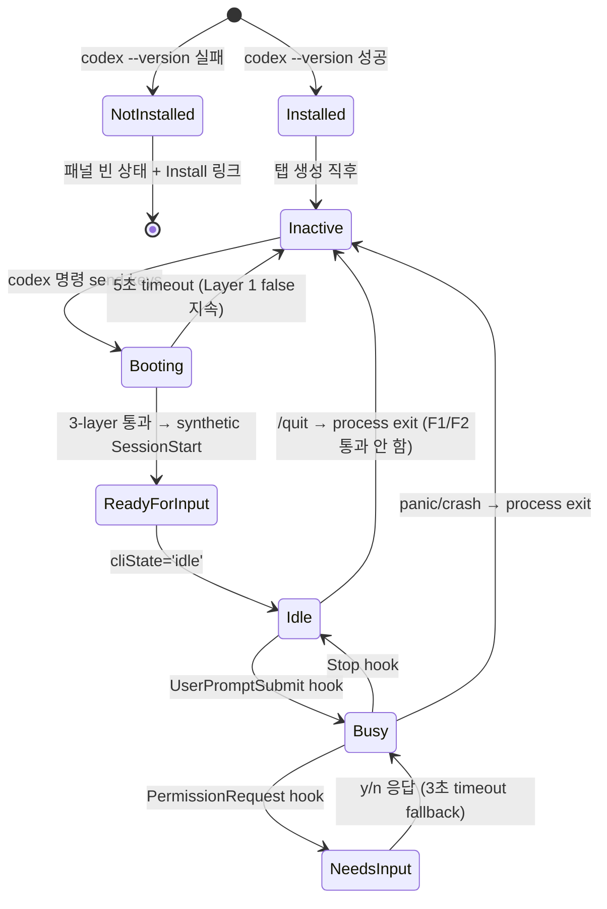

# 사용자 흐름

## 1. Codex 새 대화 시작 (cold start)

1. 사용자 메뉴에서 "Codex 새 대화" 클릭 (또는 `Cmd+Shift+X`)
2. 서버: `panelType: 'codex-cli'` 신규 탭 생성 + tmux session 생성
3. 서버: `providers/codex/client.ts`가 launch 인자 빌드
   - `-c developer_instructions=<TOML triple-quoted>` (workspace의 `codex-prompt.md` 내용)
   - `-c hooks.SessionStart=...` (그 외 3개 이벤트 동일)
   - 사용자 `~/.codex/config.toml` 머지 (`[...ourEntries, ...userEntries]`)
4. 서버: tmux send-keys로 `codex` 명령 발사 (sendKeysSeparated — text + 50ms + Enter)
5. shell → `node (codex.js shim)` → `codex (Rust binary)` 프로세스 트리 형성
6. cliState = `inactive` 유지 (Codex SessionStart hook은 첫 메시지 후 발사)
7. **TUI ready 감지** (별도 feature) 3-layer 검사 통과 → synthetic SessionStart → cliState = `idle`
8. WebInputBar 활성화 → 사용자 첫 메시지 입력 가능

## 2. Codex 세션 resume

1. 사용자 "Codex 세션 목록" 메뉴에서 세션 클릭
2. 서버: `codex resume <sessionId>` 인자 빌드 (system prompt + hook 머지 동일)
3. tmux send-keys 실행 → codex가 jsonl 다시 읽고 복원
4. `entry.lastResumeOrStartedAt = now` 갱신 (status-resilience F1 grace 가동)
5. 5초 grace 윈도우 동안 process 미감지여도 ping-pong 차단
6. 정상 SessionStart hook 도착 → 기존 메타 보존 + cliState = `idle`

## 3. Provider 전환 (같은 탭 panelType 변경)

1. 사용자 패널 selector에서 Claude → Codex 클릭
2. **잠금 검사** (`codex-panel-ui` feature):
   - 현재 cliState busy/idle/needs-input/ready-for-review → 차단 + 토스트
   - inactive/unknown → 진행
3. `agentState` 덮어쓰기:
   - Claude는 `claude*` legacy fallback 있음 → 다음 launch에서 자연 resume
   - Codex는 legacy 없음 → 새 session 시작 (이전 codex 메타 잃음)
   - 사용자가 codex 이전 session 복구 원하면 codex 세션 목록에서 직접 resume
4. panelType 변경 즉시 패널 마운트 교체 (CLI 프로세스는 안 죽임 — display만 변경)

## 4. 상태 전이

## 5. Optimistic UI

| 액션 | 낙관적 업데이트 | 롤백 시나리오 |
| --- | --- | --- |
| Codex 새 대화 메뉴 클릭 | 즉시 새 탭 생성 + 패널 마운트 | tmux session 생성 실패 시 탭 제거 + 토스트 |
| Provider 전환 | 즉시 panelType 변경 + 패널 교체 | 잠금 위반은 사전 검사로 차단 (롤백 없음) |
| 메시지 송신 | WebInputBar 즉시 클리어 | send-keys 실패 시 입력 복원 + 토스트 |

## 6. 엣지 케이스

| 케이스 | 처리 |
| --- | --- |
| codex shim이 node 실행 실패 (PATH 문제) | preflight에서 사전 차단. launch 시점 실패 시 에러 토스트 + 패널 빈 상태 복귀 |
| 같은 워크스페이스에 codex 탭 + claude 탭 동시 | 각 탭 독립 — agentState/세션 분리. 잠금은 같은 탭 panelType 전환에만 적용 |
| `codex-prompt.md` 사용자 수동 편집 | 다음 launch에 buildBody가 덮어씀 (auto-managed file) |
| sessionId 충돌 (Claude UUID와 동일 — 이론상) | session-meta-cache 키가 `${providerId}:${sessionId}` 형식 (`codex-data-aggregation`) → 충돌 회피 |
| codex resume 시 jsonl 파일 삭제됨 | codex가 자체 에러 출력 → `error-notice` entry로 timeline 표시 |

## 7. 빠른 체감 속도

- 메뉴 hover 시 `providers/codex/client.ts` 인자 빌드 prefetch (TOML 직렬화 결과 캐시)
- `codex-prompt.md`는 워크스페이스 생성/수정 시 미리 작성 (launch 시점 I/O 0)
- preflight 결과는 메모리 캐시 (서버 부트 시 1회 + manual refresh 트리거)
