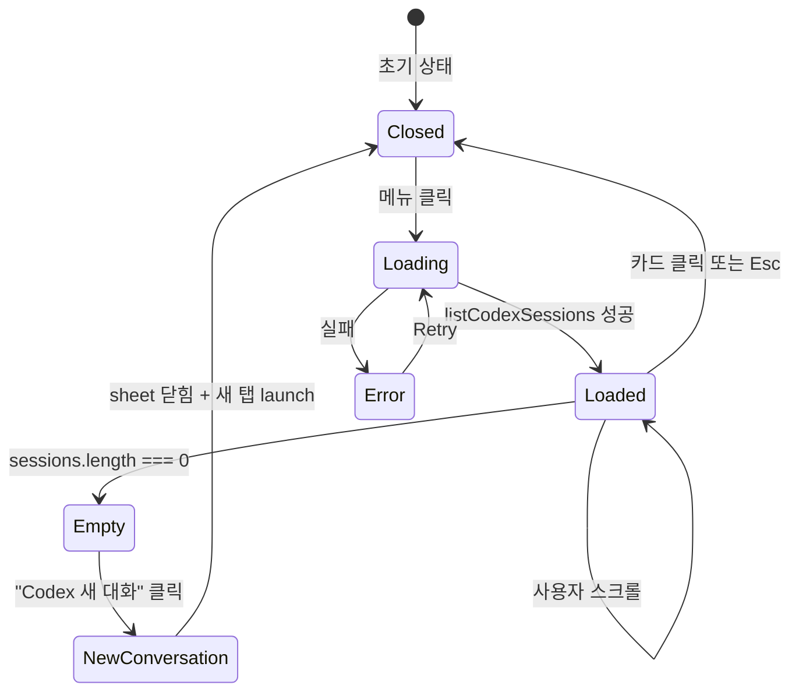

# 사용자 흐름

## 1. Codex 세션 목록 sheet 열기

1. 사용자 메뉴에서 "Codex 세션 목록" 클릭 (또는 빈 상태 패널의 미리보기 영역 액션)
2. 클라이언트: 즉시 sheet 마운트 + `loading=true`
3. `listCodexSessions({ cwd: workspace.cwd })` 호출
4. 응답 도착 → sessions 목록 렌더 (가상 스크롤)
5. 빈 결과 → 빈 상태 표시 + Codex 새 대화 버튼

## 2. 세션 클릭 → resume

1. 사용자 카드 클릭
2. 즉시 sheet 닫힘 (낙관적)
3. 같은 워크스페이스의 새 탭 또는 현재 탭에서 `codex resume <sessionId>` 실행
4. tmux send-keys (sendKeysSeparated) → codex가 jsonl 다시 read
5. cliState='inactive' → boot indicator → idle (3-layer 통과)
6. timeline-view에 기존 entry 모두 표시 (incremental parsing)

## 3. Prefetch 흐름

1. 사용자 메뉴 항목 hover (200ms+)
2. `onMouseEnter` → `listCodexSessions` 워밍 (백그라운드 호출)
3. 결과는 react-query 캐시에 저장 (staleTime 30s)
4. 실제 클릭 → 즉시 데이터 표시 (대기 시간 0)

## 4. Retry 흐름

1. 에러 상태 표시
2. 사용자 Retry 클릭
3. skeleton 재진입 + `listCodexSessions` 재호출
4. 성공 → 정상 목록 / 실패 → 다시 에러

## 5. 상태 전이

## 6. Optimistic UI

| 액션 | 낙관적 업데이트 | 롤백 |
| --- | --- | --- |
| 카드 클릭 (resume) | 즉시 sheet 닫힘 + 새 탭 활성화 | resume 실패 시 토스트 D + 빈 상태 복귀 |
| Codex 새 대화 (빈 상태) | 즉시 sheet 닫힘 + 새 탭 launch | tmux 실패 시 동일 |
| Retry | 즉시 skeleton 재진입 | 실패 시 다시 에러 |

## 7. 엣지 케이스

| 케이스 | 처리 |
| --- | --- |
| 세션이 매우 많음 (1000+) | 가상 스크롤로 부드러움 — 비용은 디렉토리 스캔 |
| `~/.codex/sessions/` 미존재 (codex 첫 사용 전) | 빈 상태 표시 (정상) |
| 일부 jsonl 파일 손상 (첫 줄 파싱 실패) | 해당 항목 skip + `logger.warn` (dedup) |
| 자정 직후 새 디렉토리 (`YYYY/MM/DD`) | 다음 스캔 사이클에 자동 포함 |
| 사용자 cwd 변경 (워크스페이스 디렉토리 추가) | 다음 sheet 재진입 시 새 cwd로 재계산 |
| 가상 스크롤 측정 실패 (특이 환경) | fallback: 일반 스크롤 (성능 ↓ 약간) |
| 카드 클릭 후 codex 미설치 (preflight 변경) | resume 시도 → 토스트 A → 빈 상태 복귀 |
| sheet 열린 채로 다른 워크스페이스 전환 | 자동 닫기 + cwd 변경 알림 (옵션) |
| 모바일에서 bottom sheet drag down | 자동 닫힘 (Sheet 기본) |

## 8. 빠른 체감 속도

- Prefetch (메뉴 hover) → 클릭 즉시 표시
- session-meta-cache (`codex-data-aggregation` 정의) — 같은 jsonl 재read 회피
- 가상 스크롤 — 100+ 세션도 60fps
- 디렉토리 스캔 비용 가드:
  - 최근 30일만 (이전은 archived 취급)
  - 첫 줄만 read (전체 파일 파싱 안 함)
  - 결과 캐시 staleTime 30s

## 9. UX 완성도 — 토스급

- **로딩 상태**: skeleton 3개 (실 항목 비례)
- **빈 상태**: 단순 "없음" 아닌 "Codex 새 대화" 액션 제공
- **에러 상태**: Retry 버튼 + 실패 이유 (간단)
- **인터랙션**: hover 시 모델명 tooltip — 정보 밀도 ↑ 노이즈 X
- **시각 정보 밀도**: 첫 user message + 시간 + cwd + 토큰 — 사용자가 어떤 세션인지 즉시 식별
- **모바일 패리티**: bottom sheet + 큰 터치 타겟

## 10. 회귀 검증 시나리오

| 시나리오 | 기대 결과 |
| --- | --- |
| 빈 워크스페이스에서 sheet 열기 | 빈 상태 표시 |
| 5개 세션 환경 | 정상 목록 + 가상 스크롤 (또는 일반) |
| 100+ 세션 환경 | 부드러운 스크롤 (60fps) |
| 카드 클릭 → resume → idle | 정상 boot + timeline 복원 |
| 메뉴 hover → 클릭 (prefetch 시나리오) | 대기 시간 0 |
| jsonl 파일 손상 1개 포함 | 해당 항목 skip, 나머지 정상 |
| 자정 직후 새 세션 | 다음 sheet 진입 시 표시 |
| 모바일 bottom sheet drag | 정상 닫힘 |
| Retry 후 성공 | 정상 표시 |
| 같은 sheet 두 번 열기 | 두 번째는 즉시 표시 (캐시) |
