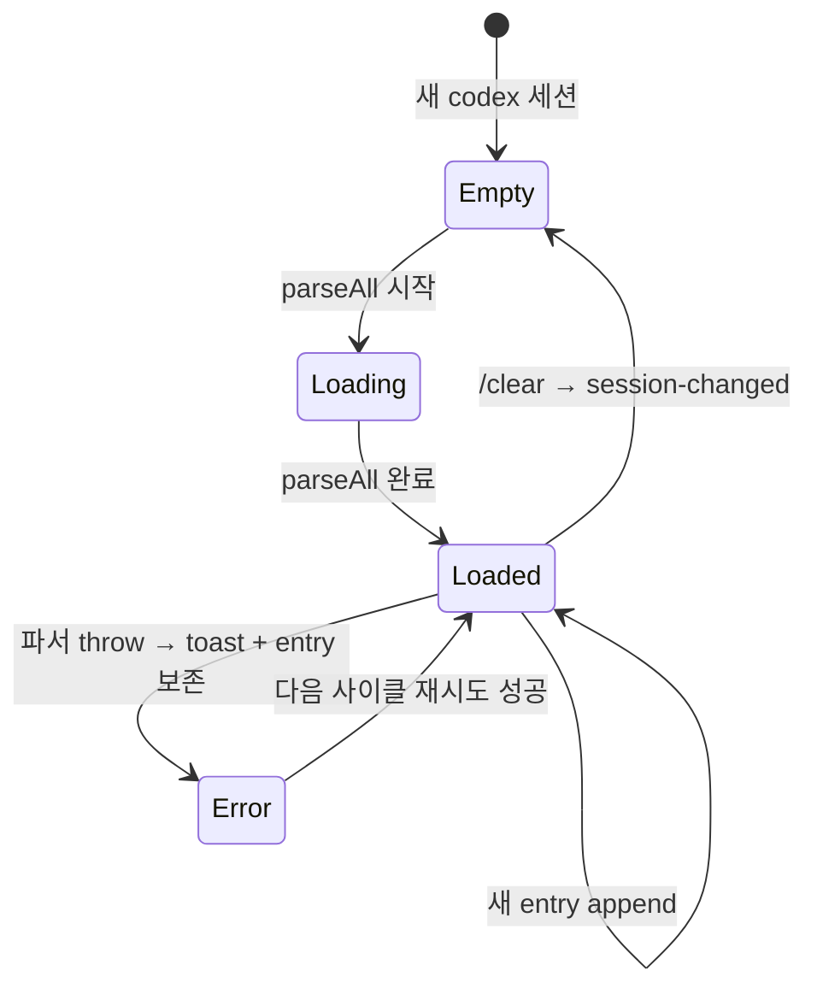

# 사용자 흐름

## 1. Codex 세션 시작 → timeline 마운트

1. 사용자 Codex 새 대화 또는 resume
2. SessionStart hook → `entry.jsonlPath` 채워짐
3. timeline-server: `createParser(jsonlPath)` 호출 → jsonl path 검사로 `CodexParser` 인스턴스
4. `parseAll()` → 기존 라인 모두 파싱 → `ITimelineEntry[]` 반환
5. WebSocket `timeline:append` → 클라이언트 `TimelineView` 마운트
6. 신규 8개 컴포넌트 + 기존 12개로 entry 렌더

## 2. Turn 진행 — entry 추가 흐름

1. 사용자 입력 → `event_msg.user_message` 라인 append
2. 파서 → `user-message` entry 발사 → 기존 `user-message-item` 컴포넌트
3. codex reasoning → `response_item.reasoning` 라인 append
4. 파서 → `reasoning-summary` entry 발사 → **신규** `reasoning-summary-item` 컴포넌트
5. codex tool 호출 → `response_item.function_call` 라인 append
6. 파서 → `tool-call` entry 발사 → 기존 `tool-call-item` 컴포넌트
7. tool 결과 → `response_item.function_call_output` 라인 append
8. 파서 → `tool-result` entry 발사 → 기존 매칭 처리
9. agent message → `event_msg.agent_message` 라인 append
10. 파서 → `assistant-message` entry 발사 → 기존 컴포넌트 (usage undefined)
11. turn 종료 → `event_msg.TurnComplete` → `turn-end` entry

각 entry는 `timeline:append` 메시지에 batch (50ms 윈도우)로 클라이언트 push.

## 3. ExecCommand stream 흐름

1. codex shell 명령 실행 → `ExecCommandBegin(call_id, command)` 라인
2. 파서 in-flight Map에 저장 — entry 발사 안 함
3. stdout chunk 도착 → `ExecCommandDelta(call_id, chunk)` 여러 번 → 메모리 누적
4. 명령 종료 → `ExecCommandEnd(call_id, exit_code, duration_ms)` 라인
5. 파서 → 단일 `exec-command-stream` entry 발사 (전체 stdout 포함)
6. 클라이언트 `exec-command-stream-item` 마운트:
   - 헤더에 명령 + exit code + duration 표시
   - stdout collapsed default
   - 사용자 "출력 보기" 클릭 → height transition + 전체 표시

## 4. PatchApply 흐름

1. codex 패치 시작 → `PatchApplyBegin(call_id)` → in-flight 저장
2. 파일별 `PatchApplyUpdated(call_id, path, status)` 여러 번 → files 누적
3. `PatchApplyEnd(call_id, success)` → 단일 `patch-apply` entry 발사
4. 클라이언트 `patch-apply-item` 마운트:
   - 헤더에 파일 수 + 성공/실패
   - 파일 목록 (각 path + operation)
   - 사용자 "Diff 보기" 클릭 → 기존 ToolCall diff 컴포넌트 마운트

## 5. /clear 후 timeline reset

1. 사용자 `/clear` → SessionStart hook (`source: 'clear'`)
2. handleCodexHook → 메타 reset + `globalThis.__ptCodexHookEvents.emit`
3. timeline-server: 기존 파서 인스턴스 폐기 + 새 jsonl path로 새 파서
4. WebSocket `timeline:session-changed` 발사 (reason: 'new-session-started')
5. 클라이언트: `TimelineView`가 메시지 수신 → 모든 entry 클리어 → 새 빈 timeline
6. 새 라인 도착부터 정상 append

## 6. Resume 흐름

1. 사용자 codex 세션 클릭 → `codex resume <id>`
2. codex가 기존 jsonl 파일 다시 read (append-only)
3. SessionStart hook → 동일 jsonlPath
4. timeline-server: 기존 파서 인스턴스가 모든 라인 처리 완료 — 새 라인만 처리
5. 클라이언트 timeline은 그대로 (이미 모든 entry 표시 중)
6. 새 메시지부터 정상 append

## 7. 상태 전이 — Timeline view

## 8. 사용자 인터랙션 흐름

### 자세히 보기 toggle

1. 사용자 entry 내 "자세히 보기" 클릭
2. `aria-expanded` 토글 + height transition
3. expanded 상태는 컴포넌트 local state — 다른 entry와 독립

### 새 entry append + 자동 스크롤

1. WebSocket `timeline:append` 수신
2. timeline 끝에 entry 추가 → fade-in (150ms)
3. 사용자가 viewport 하단 근처면 → smooth scroll-to-bottom
4. 사용자가 위로 스크롤 중이면 → 자동 스크롤 disabled (기존 패턴)
5. 새 메시지 도착 시 "↓ 새 메시지" floating 버튼 표시

### 코드 블록 복사

1. 사용자 코드 블록 우상단 복사 아이콘 클릭
2. `navigator.clipboard.writeText` → 토스트 "복사됨"

## 9. Optimistic UI

| 액션 | 낙관적 업데이트 | 롤백 |
| --- | --- | --- |
| 사용자 메시지 송신 | WebInputBar 클리어 + 임시 `user-message` entry (id='temp-...') | jsonl 라인 도착 → 실제 entry 교체 |
| 자세히 보기 toggle | 즉시 expand/collapse | N/A (client-side only) |
| 코드 블록 복사 | 즉시 토스트 | clipboard API 실패 시 토스트 변경 |

## 10. 엣지 케이스

| 케이스 | 처리 |
| --- | --- |
| 파서 라인 1개 실패 | `error-notice` entry 발사 → 사용자가 보고 가능 |
| in-flight Begin 후 End 영구 누락 (codex crash) | 다음 turn 시작 시 stale 정리 + `error-notice` 발사 |
| 매우 긴 stdout (수 MB) | 파서가 truncate + "[... truncated]" 표시 |
| 이상한 entry type (알 수 없음) | TimelineEntryRenderer default → null (skip) |
| Claude `thinking` entry 도착 | switch에 case 없어 dispatch 안 됨 — 기존 미표시 정책 유지 |
| Claude `agent-group` entry | 기존 컴포넌트 그대로 (Codex는 발사 안 함) |
| `assistant-message`에 usage 없음 (Codex) | optional 처리 — 컴포넌트가 graceful (token 표시 skip) |
| timeline 매우 긴 세션 (수만 entry) | 가상 스크롤로 부드러움 — 메모리 일정 |
| 모바일 가로 회전 시 diff 잘림 | `overflow-x-auto`로 가로 스크롤 |
| 사용자가 자세히 보기 expanded 상태에서 새 entry 도착 | local state 유지 — 다른 entry 영향 없음 |

## 11. 빠른 체감 속도

- WebSocket batch (50ms 윈도우) — 라인 폭주 시 묶어서 dispatch
- 가상 스크롤 — 수만 entry도 60fps
- 신규 컴포넌트는 React.memo 적용 (entry id 변경 시만 재렌더)
- height transition은 GPU 가속 (`transform`/`opacity`만)
- 코드 구문 강조는 lazy (자세히 보기 expanded 시만)

## 12. UX 완성도 — 토스급

- **빠르다**: 가상 스크롤 + batch dispatch + lazy syntax highlight
- **로딩/빈/에러**: 모두 명시 (skeleton, "아직 없음", error-notice 흡수)
- **인터랙션**: toggle 부드러운 transition, 자동 스크롤 + 사용자 의도 보호
- **시각 정보 밀도**: 헤더 한 줄 + 자세히 보기 — 노이즈 없이 핵심 표시
- **에러 가시성**: error-notice 4 severity 분기 — 디버깅 가능

## 13. 회귀 검증 시나리오

| 시나리오 | 기대 결과 |
| --- | --- |
| 풀 turn (reasoning + tool + message) | 모든 entry 정상 렌더, 순서대로 |
| ExecCommand stream + 긴 stdout | 단일 entry + collapsed/expanded 정상 |
| Web search 호출 + 결과 | 결과 요약 표시 |
| MCP tool 호출 | server 이름 + 자세히 보기 |
| PatchApply multi-file | 파일 목록 + diff 표시 |
| Approval request 각 종류 | 종류별 시각 분기 정상 |
| Error notice 4 severity | 색상/아이콘/배지 정상 |
| Reasoning summary | summary[] 표시 + "hidden" 안내 |
| Context compacted | 토큰 변화 표시 |
| /clear 후 timeline 클리어 | 빈 상태 → 새 entry 정상 |
| Resume 후 기존 timeline 표시 | incremental 정상 |
| Claude 패널 무회귀 | thinking 미표시, agent-group 정상 |
| 모바일 long stdout 가로 스크롤 | 정상 |
| 가상 스크롤 부드러움 (수만 entry) | 60fps 유지 |
| 자세히 보기 expanded 상태에서 새 entry | 기존 expanded 유지 |
