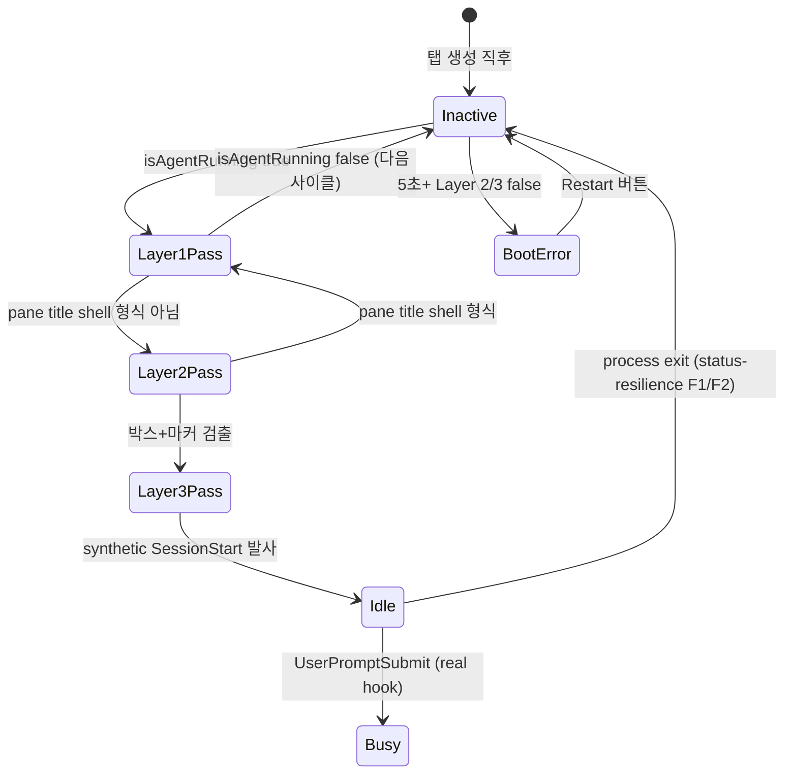

# 사용자 흐름

## 1. 기본 흐름 — codex cold start

1. 사용자 `codex` 명령 실행 (메뉴 클릭 또는 터미널 직접 입력)
2. shell → `node (codex.js shim)` → `codex (Rust binary)` 트리 형성
3. status-manager 폴링 사이클 진입 (cliState='inactive')
4. **Layer 1**: `provider.isAgentRunning(panePid)` 호출 → grandchild walk로 codex Rust 자식 검출
   - false → 다음 사이클 대기 (skip Layer 2/3)
   - true → Layer 2 진행
5. **Layer 2**: pane title 형식 검사
   - shell-style `cmd|path` → 아직 OSC 0 미발사 → false → 대기
   - 아니면 (codex SessionConfigured 통과) → true → Layer 3 진행
6. **Layer 3**: pane content 캡처 (`capturePaneAtWidth`, ~수십 ms)
   - `╭` AND `╰` (composer 박스) AND (`›` OR `!`) 모두 통과 시 true
   - 미통과 시 다음 사이클 대기
7. 모두 통과 + cliState='inactive'면 `updateTabFromHook(session, 'session-start')` synthetic 발사
8. cliState → 'idle' 전환
9. WebInputBar 활성화 → 사용자 입력 가능

## 2. 정상 SessionStart hook과의 race

- codex SessionStart hook은 사용자 첫 메시지 후 발사 (`turn.rs:299`)
- 본 feature의 synthetic SessionStart는 **첫 메시지 전**에 발사
- 충돌 방지:
  - synthetic 발사 후 cliState='idle' 진입 → 다음 사이클부터 분기 안 들어감 (idempotent)
  - 실제 hook 도착 시점엔 이미 'idle' → `handleCodexHook`의 보수적 분기 통과 (cliState 유지)
  - 메타(`agentSessionId`/`jsonlPath`)는 실제 hook이 처음 채움 — synthetic은 메타 안 건드림

## 3. /clear 후 반복

1. 사용자 `/clear` 입력
2. codex가 새 sessionId로 갈아끼움 + SessionStart hook (`source: 'clear'`) 발사
3. handleCodexHook이 강제 idle 전환 + 메타 reset
4. cliState='idle' 유지 → Layer 검사는 다음 사이클에 분기 안 들어감 (idempotent)

## 4. 상태 전이

## 5. Optimistic UI

| 액션 | 낙관적 업데이트 | 롤백 |
| --- | --- | --- |
| codex 명령 send-keys | 즉시 boot indicator 표시 (cliState='inactive' 유지) | Layer 통과까지 indicator 유지 |
| Restart 버튼 | spinner 즉시 + 1초 후 boot indicator 재진입 | send-keys 실패 시 토스트 + 빈 상태 |

## 6. 엣지 케이스

| 케이스 | 처리 |
| --- | --- |
| Layer 1 통과 + Layer 2 false 영구 (codex가 OSC 0 안 보냄 — 매우 드묾) | 30초 후 boot error 표시 (사용자 액션 유도). 본 케이스는 codex 버그 — 정상은 즉시 OSC 발사 |
| Layer 3에서 zsh prompt 잔상이 `╭`/`╰` 포함 (oh-my-posh 일부 테마) | 마커(`›`/`!`) 동시 검사로 false positive ↓. 그래도 통과되면 cliState='idle'로 잘못 진입 가능 — 사용자가 첫 메시지 입력 시 codex 본체 응답 없으면 자연 발견 + 토스트로 회복 권장 |
| Layer 3 통과 직후 Layer 1 false (codex crash) | status-resilience F1 grace 5초 → cliState='inactive' 안전 복귀 |
| pane content 캡처 실패 | Layer 3 false 처리 + 다음 사이클 재시도 (`logger.warn` 1회) |
| 폴링 사이클 길이(30s/45s/60s)로 인해 사용자 대기 1-30초 | UX: boot indicator + 단계별 메시지로 체감 부담 ↓. 별도 fast-poll 도입은 비용 대비 효과 낮음 |
| `prefers-reduced-motion` 환경 | spinner 정지 + 정적 아이콘 + 텍스트만으로 진행 표시 |

## 7. 빠른 체감 속도

- Layer 1 빠르게 false면 Layer 2/3 skip → 미실행 codex 탭 영향 0
- pane content 캡처는 cliState='inactive' + Layer 1+2 통과 후만 — 활성 codex 탭 평균 1-2회/사이클
- 폴링 사이클이 30s지만 codex 부팅 평균 1-2초 → 첫 사이클에 통과 가능성 높음
- 사용자 액션(메뉴 클릭) 직후 status-manager에 fast-tick 트리거 (옵션, v19 외부) — 30s 대기 회피

## 8. 회귀 검증 시나리오

| 시나리오 | 기대 결과 |
| --- | --- |
| 빈 탭에서 `codex` 입력 → 1-2초 내 cliState='idle' | 통과 |
| zsh prompt만 있는 상태 (codex 미실행) | cliState='inactive' 유지 (false positive 0) |
| oh-my-zsh + p10k 환경 | 동일 (박스 문자 없음) |
| spaceship/oh-my-posh `›` 포함 테마 | 박스 조건으로 차단 — cliState='inactive' 유지 |
| codex 시작 직전 zsh prompt 잔상 | 박스 미존재 → false |
| /clear 직후 | 이미 'idle' → 분기 안 들어감 (idempotent) |
| codex crash 후 5초 → cliState='inactive' | F1 grace + F2 통과 안 함 → 정상 복귀 |
