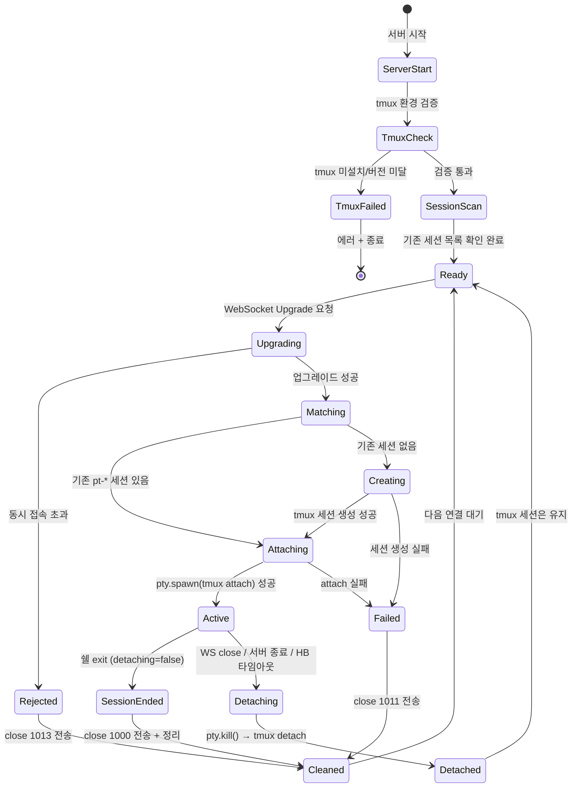

# 사용자 흐름

> tmux-backend의 "사용자"는 클라이언트(웹 터미널)이다. 이 문서는 서버 사이드의 tmux 세션 관리, 연결 생명주기, 에러 처리 흐름을 정의한다.

## 1. 서버 시작 흐름

```
서버 시작
→ tmux 환경 검증
  - which tmux → 없으면 에러 + 종료
  - tmux -V → 2.9 미만이면 에러 + 종료
→ tmux -L purple ls → 기존 pt-* 세션 목록 조회
  - dead 세션 발견 → tmux -L purple kill-session -t {name}
  - 살아있는 세션 발견 → 로그 출력 (재연결 대기)
  - 세션 없음 → 로그 출력 (새 세션 대기)
→ HTTP 서버 + WebSocket 서버 시작
→ 클라이언트 연결 대기
```

## 2. 기본 흐름: WebSocket 연결 → tmux 세션 attach → 데이터 중계

```
1. 클라이언트가 /api/terminal로 HTTP 요청 (Upgrade: websocket)
2. Custom Server의 upgrade 이벤트 핸들러 진입
3. 활성 연결 수 확인
   - 10개 초과 → WebSocket close (1013) + 종료
4. HTTP → WebSocket 업그레이드 수행
5. 기존 tmux 세션 확인 (tmux -L purple ls | grep pt-)
   - 있음 → 6a로
   - 없음 → 6b로
6a. 기존 세션에 attach
   - pty.spawn('tmux', ['-L', 'purple', 'attach', '-t', sessionName])
   - tmux가 자동으로 현재 화면 redraw → 클라이언트에 전달
6b. 새 세션 생성 후 attach
   - child_process.exec('tmux -L purple new-session -d -s {name} -x 80 -y 24')
   - pty.spawn('tmux', ['-L', 'purple', 'attach', '-t', {name}])
   - 쉘 프롬프트가 렌더링됨
7. PTY 이벤트 바인딩
   - onData → WebSocket 전송 (0x01 + data)
   - onExit → detaching 플래그 확인 후 분기 처리
8. WebSocket 이벤트 바인딩
   - message → 메시지 타입별 분기 처리
   - close → detaching = true → pty.kill() (tmux detach) → 리소스 정리
   - error → 로그 + detaching = true → pty.kill() → 정리
9. 하트비트 타이머 시작 (30초 간격 체크)
10. 양방향 데이터 중계 시작
```

## 3. 메시지 수신 처리 흐름

Phase 1과 동일:

```
WebSocket message 수신
→ 첫 바이트로 타입 판별
→ 타입별 분기:

  0x00 (STDIN):
    payload → pty.write(payload)

  0x02 (RESIZE):
    cols = payload[0:2] as uint16
    rows = payload[2:4] as uint16
    → pty.resize(cols, rows)
    (tmux aggressive-resize가 세션 크기에 반영)

  0x03 (HEARTBEAT):
    → 하트비트 타이머 리셋
    → WebSocket send (0x03) // pong

  그 외:
    → 무시 (로그 기록)
```

## 4. PTY stdout 전송 흐름

Phase 1과 동일 (node-pty I/O 재활용):

```
PTY onData 이벤트 (tmux attach 프로세스의 stdout)
→ data (Buffer)
→ frame = [0x01] + data
→ WebSocket send(frame)
→ backpressure 체크:
  - ws.bufferedAmount > 1MB → pty.pause()
  - ws.bufferedAmount < 256KB → pty.resume()
```

## 5. 연결 종료 흐름

### 세션 종료 (쉘 exit)

```
사용자 exit / Ctrl+D
→ tmux 세션 내 쉘 프로세스 종료
→ tmux 세션 소멸 (마지막 프로세스 종료)
→ attach된 PTY 프로세스도 종료
→ pty.onExit({ exitCode, signal })
→ detaching === false → 세션이 진짜 끝남
→ WebSocket close (1000, "Session exited")
→ 하트비트 타이머 정리
→ connections에서 제거
→ 로그: "[terminal] tmux session ended: pt-..."
```

### 세션 종료 (UI 버튼)

```
클라이언트가 종료 요청 전송
→ 서버가 tmux -L purple kill-session -t {name} 실행
→ tmux 세션 강제 종료
→ attach된 PTY onExit 발생
→ detaching === false → 세션이 진짜 끝남
→ WebSocket close (1000, "Session exited")
→ 리소스 정리
```

### 의도적 detach (새로고침/네트워크 끊김/탭 닫기)

```
WebSocket close 이벤트 수신
→ detaching = true 설정
→ pty.kill() 호출 → tmux 관점에서 client detach
→ pty.onExit 발생
→ detaching === true → close code 전송하지 않음 (이미 WS 닫힘)
→ 하트비트 타이머 정리
→ connections에서 제거
→ 로그: "[terminal] detached from tmux session: pt-..."
→ tmux 세션은 계속 살아있음
```

### 하트비트 타임아웃

```
마지막 하트비트 수신으로부터 90초 경과
→ detaching = true 설정
→ WebSocket close (1001, "Heartbeat timeout")
→ pty.kill() → tmux detach
→ 리소스 정리
→ tmux 세션은 유지
```

## 6. 서버 종료 흐름

```
process.on('SIGTERM') / process.on('SIGINT')
→ 모든 활성 연결에 대해:
  - WebSocket close (1001, "Server shutting down")
  - detaching = true 설정
  - pty.kill() → tmux detach
  - 리소스 정리
→ WebSocket 서버 close
→ 프로세스 종료
→ tmux 세션은 모두 살아있음 (재시작 시 재연결 가능)
```

## 7. 재연결 흐름 (서버 재시작 후)

```
서버 재시작
→ tmux 환경 검증 (통과)
→ tmux -L purple ls → 기존 pt-* 세션 발견
→ 로그: "[terminal] existing tmux session found: pt-..."

클라이언트 자동 재연결 (지수 백오프)
→ WebSocket 연결 성공
→ 서버: 기존 pt-* 세션에 attach
→ pty.spawn('tmux', ['-L', 'purple', 'attach', '-t', sessionName])
→ tmux가 자동 redraw → 이전 화면 상태 복원
→ 클라이언트: 터미널에 이전 상태가 렌더링됨
→ 사용자 체감: "잠깐 끊겼다가 이어지는" 경험
```

## 8. 상태 전이



## 9. 엣지 케이스

### tmux 세션 생성 실패

- tmux 소켓 권한 문제, 디스크 공간 부족 등
- 처리: WebSocket close (1011, "Session create failed") + 에러 로그

### tmux attach 실패

- 세션 목록 조회와 attach 사이에 세션이 종료될 수 있음 (race condition)
- 처리: attach 실패 시 새 세션 생성 시도 → 재실패 시 1011

### 서버 재시작 중 클라이언트 재연결 타이밍

- 서버가 아직 준비되지 않은 상태에서 클라이언트가 재연결 시도
- 처리: 클라이언트의 지수 백오프 재연결이 자연스럽게 대기

### 다중 탭 + 세션 종료

- Tab A에서 `exit` 실행 → tmux 세션 소멸
- Tab B의 attach PTY도 onExit 발생 → detaching=false → 1000 전송 → session-ended UI
- 양쪽 모두 올바르게 세션 종료 UI 표시

### pty.kill()이 tmux 세션을 종료하는 경우

- `pty.kill()`은 attach 프로세스만 종료하므로, tmux 세션은 유지되어야 함
- 만약 예상과 다르게 tmux 세션이 종료되면 detaching 플래그로 보호됨
- 서버 시작 시 세션 존재 여부를 다시 확인하므로 자가 복구

### 동시에 WebSocket close + PTY exit

- Phase 1과 동일: `cleaned` 플래그로 중복 정리 방지 (멱등성)
- `detaching` 플래그와 `cleaned` 플래그는 독립적으로 동작
