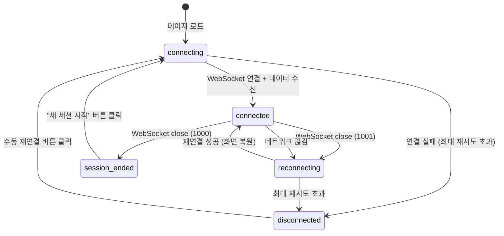

# 사용자 흐름

> Phase 2에서 클라이언트 측 흐름 변경은 최소한이다. 기존 흐름을 유지하며, tmux 세션 영속성으로 인해 달라지는 부분만 명시한다.

## 1. 기본 흐름: 최초 접속

Phase 1과 동일:

1. 사용자가 `localhost:{port}`에 접속
2. Next.js가 페이지를 렌더링 (터미널 배경색만 보이는 빈 화면)
3. 폰트 로딩 (JetBrains Mono)
4. 컴포넌트 마운트 → WebSocket 연결 시작 (`connecting` 상태)
5. WebSocket 연결 성공 → 서버가 tmux 세션 생성 + attach
6. xterm.js Terminal 인스턴스 생성 + 애드온 로드
7. `fitAddon.fit()` → 초기 cols/rows → RESIZE 메시지 전송
8. PTY stdout 수신 → 쉘 프롬프트 렌더링
9. 사용자 입력 대기 (`connected` 상태)

**체감 속도 목표**: 접속 ~ 프롬프트 표시까지 500ms 이내

## 2. 새로고침 흐름 (Phase 2 신규)

```
사용자 F5 / Cmd+R
→ 이전 WebSocket 끊김 (서버: detaching=true → pty.kill() → tmux detach)
→ 페이지 리로드
→ connecting 상태 (중앙 스피너)
→ WebSocket 연결 성공
→ 서버: 기존 pt-* 세션 발견 → attach
→ tmux 자동 redraw → 이전 화면 데이터 수신
→ xterm.js에 이전 화면 렌더링
→ connected 상태 (스피너 fade out 150ms)
→ 이전 터미널 상태 복원 완료
```

**핵심**: 사용자에게 session-ended UI가 표시되면 안 됨. 서버 측 `detaching` 플래그가 이를 보장.

## 3. 서버 재시작 후 재연결 흐름

```
서버 종료 → close code 1001 수신
→ reconnecting 상태 (재연결 시도 중 + 횟수 표시)
→ 지수 백오프 재연결 시도 (1s → 2s → 4s → 8s → 16s)
→ 서버 재시작 후 WebSocket 연결 성공
→ 서버: 기존 pt-* 세션 발견 → attach
→ tmux 자동 redraw → 이전 화면 복원
→ connected 상태 (재연결 오버레이 fade out)
→ 이전 작업 이어서 진행
```

**체감**: 서버가 빨리 재시작되면 "잠깐 끊겼다가 돌아옴". 재연결 오버레이가 표시되는 동안 xterm.js 인스턴스는 유지됨.

## 4. 네트워크 끊김 후 복원 흐름

```
네트워크 끊김 → WebSocket close
→ reconnecting 상태
→ 지수 백오프 재연결 시도
→ 네트워크 복원 → WebSocket 연결 성공
→ 서버: 기존 tmux 세션에 attach
→ 화면 복원
```

## 5. 세션 종료 흐름

### exit 입력

```
사용자가 exit 입력
→ 서버에서 close code 1000 수신
→ session-ended 상태
→ 하단 오버레이: "세션이 종료되었습니다." + "새 세션 시작" 버튼
→ 자동 재연결 시도하지 않음
```

### "새 세션 시작" 버튼 클릭

```
버튼 클릭
→ 새 WebSocket 연결
→ 서버: pt-* 세션 없음 → 새 tmux 세션 생성 → attach
→ 새 쉘 프롬프트 표시
→ session-ended 오버레이 제거
→ connected 상태
```

## 6. 상태 전이



Phase 1 대비 변경: `reconnecting → connected` 전환 시 **화면 복원**이 추가됨 (tmux redraw).

## 7. 엣지 케이스

### 재연결 중 서버가 아직 준비 안 됨

- 지수 백오프가 자연스럽게 대기를 처리
- reconnecting 상태에 시도 횟수 표시 → 사용자가 상황 인지

### 재연결 성공 시 xterm.js 초기화 문제

- 새로고침: xterm.js 인스턴스가 새로 생성되므로 tmux redraw가 필요 (자동)
- 재연결 (비 새로고침): xterm.js 인스턴스가 유지됨. tmux redraw 데이터가 기존 버퍼 위에 덮어쓰여짐
- 두 경우 모두 tmux attach 시 자동 redraw로 처리되므로 특별한 클라이언트 로직 불필요

### 다중 탭에서 한쪽이 exit

- Tab A에서 exit → close 1000 → Tab A session-ended UI
- Tab B도 close 1000 수신 → Tab B session-ended UI
- 양쪽 모두 올바르게 표시됨

### 서버 종료 + 즉시 새로고침

- 서버 종료 → close 1001 → reconnecting
- 사용자가 즉시 새로고침 → 페이지 리로드 → connecting
- 서버가 아직 재시작 안 됨 → 연결 실패 → 재시도
- 서버 준비 완료 → 연결 성공 → 기존 세션 복원
