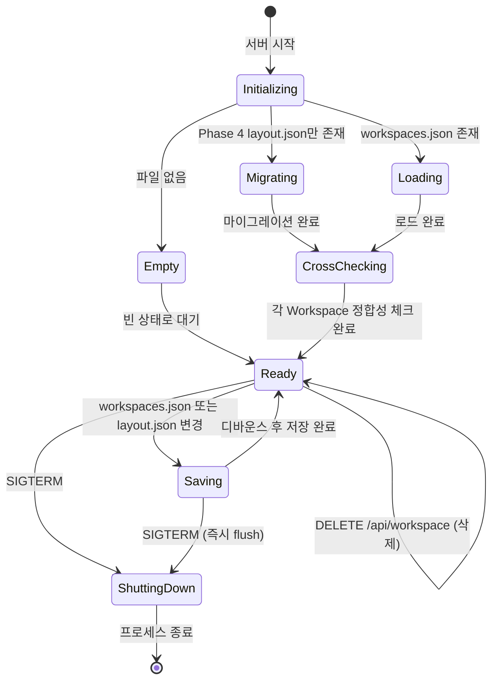

# 사용자 흐름

> workspace-api는 서버 사이드이므로, 서버 라이프사이클과 API 요청 처리 흐름을 정의한다.

## 1. 서버 시작 → Workspace 초기화

```
서버 시작 (server.ts)
→ tmux 환경 검증 (Phase 2와 동일)
→ workspaces.json 로드 시도
→ workspaces.json 없음?
  → Phase 4 layout.json 존재?
    → Yes: Phase 4 → Workspace 마이그레이션
    → No: 빈 상태 (첫 GET 요청 시 기본 Workspace 생성)
→ workspaces.json 로드 성공
→ 각 Workspace별 layout.json 로드
→ 각 Workspace별 tmux 세션 크로스 체크:
  1. tmux -L purple ls → 전체 pt-* 세션 목록
  2. pt-{wsId}-* 패턴으로 Workspace별 그룹핑
  3. 각 Workspace의 layout.json 탭과 매칭
  4. 세션 없는 탭 → 제거
  5. layout.json에 없는 세션 → 해당 Workspace 첫 Pane에 orphan 추가
  6. 빈 Pane 정리 / 빈 Workspace에 기본 탭 생성
  7. 트리 정규화
→ 변경된 layout.json 갱신 (변경 있을 때만)
→ 메모리 스토어에 로드
→ HTTP/WebSocket 서버 시작
```

### 마이그레이션 흐름

```
Phase 4 layout.json 읽기
→ JSON 파싱
→ "default" Workspace 생성:
  { id: "ws-default", name: "default", directory: os.homedir(), order: 0 }
→ workspaces/ws-default/ 디렉토리 생성
→ layout.json을 workspaces/ws-default/layout.json으로 복사
→ workspaces.json 생성
→ Phase 4 layout.json은 삭제하지 않음 (롤백용)
```

### 실패 시

- workspaces.json 파싱 실패 → 빈 상태 + 로그 경고
- layout.json 파싱 실패 → 해당 Workspace를 기본 단일 Pane으로 초기화
- tmux 크로스 체크 실패 → layout.json 그대로 사용 + 로그 경고

## 2. GET /api/workspace 처리

```
클라이언트 요청
→ 메모리 스토어에서 Workspace 목록 + 사이드바 상태 반환
→ 200 + JSON 응답
```

**캐시**: 메모리 스토어가 primary, workspaces.json은 영속성 백업

## 3. POST /api/workspace 처리

```
클라이언트 요청: { directory, name? }
→ 디렉토리 유효성 검증:
  1. fs.stat(directory) → 존재 여부
  2. 기존 Workspace 디렉토리 목록과 비교 → 중복 여부
→ 검증 실패: 400 + 에러 메시지
→ 검증 통과:
  → Workspace ID 생성 (ws-{nanoid(6)})
  → 이름 결정 (name || path.basename(directory))
  → 기본 레이아웃 생성:
    1. 새 tmux 세션 생성 (CWD = directory)
    2. 단일 Pane + 탭 1개 레이아웃 트리 구성
  → workspaces/{id}/ 디렉토리 생성
  → workspaces/{id}/layout.json 저장
  → 메모리 스토어에 Workspace 추가
  → workspaces.json 갱신 (디바운스)
  → 200 + 생성된 IWorkspace
```

### 실패 시

- 디렉토리 미존재: 400 `"디렉토리가 존재하지 않습니다"`
- 중복: 400 `"이미 등록된 디렉토리입니다"`
- tmux 세션 생성 실패: 500 + 에러 메시지

## 4. DELETE /api/workspace/{workspaceId} 처리

```
클라이언트 요청
→ 메모리 스토어에서 Workspace 조회
→ Workspace 미존재: 404
→ 존재:
  → 해당 Workspace의 모든 탭 순회
  → 각 탭의 tmux 세션 kill: tmux -L purple kill-session -t {sessionName}
  → 활성 WebSocket이 있으면 close code 1000 전송
  → workspaces/{id}/ 디렉토리 삭제 (rm -rf)
  → 메모리 스토어에서 Workspace 제거
  → workspaces.json 갱신
  → 204 No Content
```

## 5. PATCH /api/workspace/{workspaceId} 처리

```
클라이언트 요청: { name }
→ 메모리 스토어에서 Workspace 조회 → 미존재 시 404
→ 이름 갱신
→ workspaces.json 갱신 (디바운스)
→ 200 + 업데이트된 IWorkspace
```

## 6. PATCH /api/workspace/active 처리

```
클라이언트 요청: { activeWorkspaceId?, sidebarCollapsed?, sidebarWidth? }
→ 제공된 필드만 메모리 스토어 갱신
→ workspaces.json 갱신 (디바운스 300ms)
→ 200 OK
```

## 7. GET /api/workspace/validate 처리

```
클라이언트 요청: ?directory={path}
→ fs.stat(path):
  → 미존재: { valid: false, error: "디렉토리가 존재하지 않습니다" }
  → 파일 (디렉토리 아님): { valid: false, error: "파일이 아닌 디렉토리 경로를 입력하세요" }
→ 기존 Workspace 디렉토리 비교:
  → 중복: { valid: false, error: "이미 등록된 디렉토리입니다" }
→ 유효: { valid: true, suggestedName: path.basename(path) }
```

## 8. Workspace별 레이아웃 API (Phase 4 확장)

### GET /api/layout?workspace={id}

```
→ workspace 파라미터 파싱
→ 미지정: 활성 Workspace 사용 (Phase 4 하위 호환)
→ 해당 Workspace의 layout.json 메모리 스토어에서 반환
→ layout.json 없으면: 기본 단일 Pane 생성 + tmux 세션 생성
```

### PUT /api/layout?workspace={id}

```
→ workspace 파라미터 파싱
→ Phase 4와 동일한 유효성 검증
→ 해당 Workspace의 메모리 스토어 갱신
→ workspaces/{id}/layout.json 저장 (디바운스 300ms)
```

- 나머지 하위 API도 동일 패턴 (`workspace` 스코프 적용)

## 9. Graceful Shutdown

```
SIGTERM / SIGINT 수신
→ 미저장 workspaces.json 즉시 flush
→ 모든 Workspace의 미저장 layout.json 즉시 flush
→ 모든 WebSocket에 close code 1001 전송
→ WebSocket + attach PTY 정리
→ tmux 세션은 모든 Workspace에서 유지
→ 프로세스 종료
```

## 10. 상태 전이



## 11. 엣지 케이스

### workspaces.json 손상

- 파싱 실패 → 빈 상태로 시작 + `.workspaces.json.bak` 백업
- Phase 4 layout.json이 있으면 재마이그레이션

### Workspace 디렉토리 layout.json 손상

- 해당 Workspace만 기본 단일 Pane으로 초기화
- 다른 Workspace에 영향 없음

### 동시 Workspace 생성 요청

- 서버 단일 프로세스이므로 순차 처리
- 동일 디렉토리 중복 체크는 메모리 스토어 기준 (race condition 없음)

### Workspace 삭제 중 서버 종료

- tmux kill 일부 완료, 일부 미완료 상태
- 다음 서버 시작 시 크로스 체크에서 orphan 세션 정리

### 마이그레이션 중 서버 종료

- layout.json 복사 완료 → workspaces.json 쓰기 전 종료
- 다음 시작 시: workspaces.json 없음 + layout.json 존재 → 재마이그레이션
- 원자적 쓰기 (임시 파일 → rename)로 파일 손상 방지
