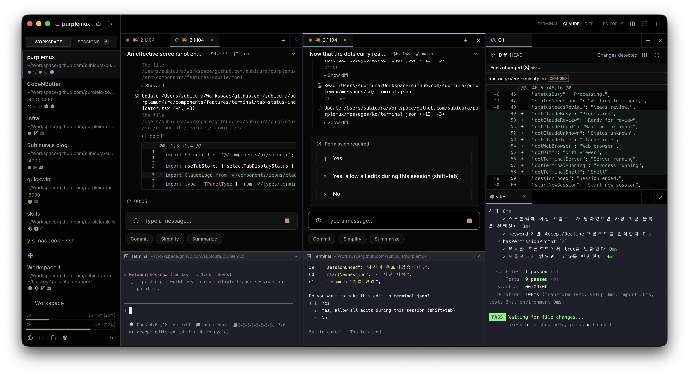
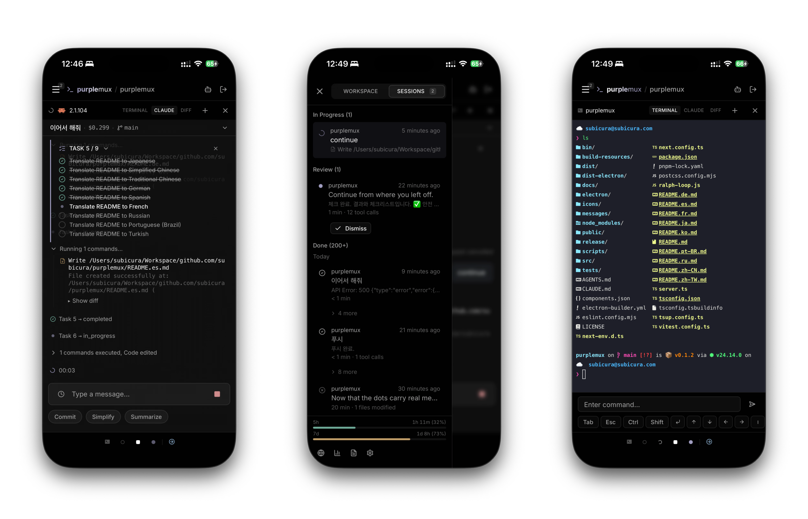

# purplemux

**Claude Code, plusieurs tâches en même temps. En plus rapide.**

Toutes vos sessions sur un seul écran. Sans coupure, même depuis le téléphone.

<a href="README.md">English</a> | <a href="README.ja.md">日本語</a> | <a href="README.zh-CN.md">简体中文</a> | <a href="README.zh-TW.md">繁體中文</a> | <a href="README.ko.md">한국어</a> | <a href="README.de.md">Deutsch</a> | <a href="README.es.md">Español</a> | Français | <a href="README.ru.md">Русский</a> | <a href="README.pt-BR.md">Português (Brasil)</a> | <a href="README.tr.md">Türkçe</a>





## Installation

```bash
npx purplemux
```

Ouvrez [http://localhost:8022](http://localhost:8022) dans votre navigateur. C'est tout.

> Nécessite Node.js 20+ et tmux. macOS ou Linux.

Vous préférez une app native ? Récupérez la build Electron macOS depuis la [dernière release](https://github.com/subicura/purplemux/releases/latest) (`.dmg` pour Apple Silicon et Intel).

## Pourquoi purplemux

- **Tableau de bord multi-session** — Visualisez d'un coup d'œil l'état « en cours / en attente d'entrée » de toutes vos sessions Claude Code
- **Suivi des limites** — Solde 5 heures / 7 jours avec compte à rebours de réinitialisation
- **Notifications push** — Alertes desktop et mobiles lorsqu'une tâche se termine ou attend une entrée
- **Mobile et multi-appareil** — Accédez à la même session depuis un téléphone, une tablette ou un autre poste
- **Vue de session en direct** — Plus besoin de faire défiler la sortie CLI : la progression est présentée sous forme de chronologie

Et aussi

- **Sessions ininterrompues** — Basé sur tmux. Fermez le navigateur, tout reste en place. À la reconnexion, vos onglets, panneaux et répertoires sont exactement là où vous les aviez laissés
- **Auto-hébergé et open source** — Le code et les données de session ne quittent jamais votre machine. Aucun serveur externe
- **Accès distant chiffré** — HTTPS depuis n'importe où via Tailscale

## Différences avec le Remote Control officiel

> Le Remote Control officiel se concentre sur le contrôle distant d'une session unique. Utilisez purplemux lorsque vous avez besoin de gestion multi-session, de notifications push et de persistance des sessions.

## Fonctionnalités

### Terminal

- **Panneaux scindés** — Découpe horizontale / verticale libre, redimensionnement par glisser
- **Gestion des onglets** — Onglets multiples, réorganisation par glisser, titres automatiques basés sur les noms de processus
- **Raccourcis clavier** — Découpe, changement d'onglet, déplacement du focus
- **Thèmes du terminal** — Mode sombre / clair, plusieurs palettes de couleurs
- **Workspaces** — Sauvegardez et restaurez la disposition des panneaux, onglets et répertoires par workspace
- **Visualiseur Git Diff** — Consultez le git diff directement dans un panneau du terminal. Bascule Side-by-side / Line-by-line, avec coloration syntaxique
- **Panneau navigateur web** — Navigateur intégré à côté du terminal pour vérifier le rendu du développement (Electron)

### Intégration Claude Code

- **État en temps réel** — Indicateurs en cours / en attente d'entrée, bascule entre sessions
- **Vue de session en direct** — Messages, appels d'outils, tâches, demandes de permission, blocs thinking
- **Reprise en un clic** — Reprenez une session suspendue directement depuis le navigateur
- **Reprise automatique** — Restauration automatique des sessions Claude au démarrage du serveur
- **Prompts rapides** — Enregistrez vos prompts récurrents et envoyez-les en un clic
- **Historique des messages** — Réutilisez vos anciens messages
- **Statistiques d'usage** — Tokens (input / output / cache read / cache write), coût, ventilation par projet, rapports IA quotidiens
- **Rate limits** — Solde 5 heures / 7 jours, compte à rebours de réinitialisation

### Mobile et accessibilité

- **Interface responsive** — Terminal et chronologie sur téléphone et tablette
- **PWA** — Ajoutez à l'écran d'accueil pour une expérience proche d'une application native
- **Web Push** — Recevez des notifications même après avoir fermé l'onglet
- **Synchronisation multi-appareil** — Les modifications de workspace sont répercutées en temps réel
- **Tailscale** — Accès HTTPS externe via un tunnel chiffré WireGuard
- **Authentification par mot de passe** — Hachage scrypt, sûr même en exposition publique
- **Multilingue** — 11 langues dont 한국어, English, 日本語, 中文

## Plateformes prises en charge

| Plateforme | État | Notes |
|---|---|---|
| macOS (Apple Silicon / Intel) | ✅ | Application Electron incluse |
| Linux | ✅ | Sans Electron |
| Windows | ❌ | Non pris en charge |

## Détails d'installation

### Prérequis

- macOS 13+ ou Linux
- [Node.js](https://nodejs.org/) 20+
- [tmux](https://github.com/tmux/tmux)

### npx (le plus rapide)

```bash
npx purplemux
```

### Installation globale

```bash
npm install -g purplemux
purplemux
```

### Depuis les sources

```bash
git clone https://github.com/subicura/purplemux.git
cd purplemux
pnpm install
pnpm start
```

Mode développement :

```bash
pnpm dev
```

#### Niveau de log

Définissez le niveau global avec `LOG_LEVEL` (par défaut `info`).

```bash
LOG_LEVEL=debug pnpm dev
```

Pour n'activer que certains modules, listez les paires `module=niveau` séparées par des virgules dans `LOG_LEVELS`. Niveaux disponibles : `trace` / `debug` / `info` / `warn` / `error` / `fatal`.

```bash
# Trace uniquement le comportement des hooks Claude Code en debug
LOG_LEVELS=hooks=debug pnpm dev

# Plusieurs modules simultanément
LOG_LEVELS=hooks=debug,status=warn pnpm dev
```

Les modules absents de `LOG_LEVELS` reprennent la valeur de `LOG_LEVEL`.

## Accès externe (Tailscale Serve)

```bash
tailscale serve --bg 8022
```

Accédez à `https://<machine>.<tailnet>.ts.net`. Pour désactiver :

```bash
tailscale serve --bg off 8022
```

## Sécurité

### Mot de passe

Définissez un mot de passe au premier accès. Il est haché avec scrypt et stocké dans `~/.purplemux/config.json`.

Pour le réinitialiser, supprimez `~/.purplemux/config.json` puis redémarrez : l'écran d'onboarding réapparaît.

### HTTPS

Par défaut, le protocole est HTTP. Utilisez impérativement HTTPS en exposition publique :

- **Tailscale Serve** — Chiffrement WireGuard et certificats automatiques
- **Nginx / Caddy** — Doit transmettre les en-têtes d'upgrade WebSocket (`Upgrade`, `Connection`)

### Répertoire de données (`~/.purplemux/`)

| Fichier | Description |
|---|---|
| `config.json` | Identifiants (hachés) et paramètres de l'application |
| `workspaces.json` | Dispositions des workspaces, onglets, répertoires |
| `vapid-keys.json` | Clés VAPID Web Push (générées automatiquement) |
| `push-subscriptions.json` | Informations d'abonnement push |
| `hooks/` | Hooks définis par l'utilisateur |

## Architecture

```
┌─────────────────────────────────────────────────────────────┐
│  Browser                                                    │
│  ┌───────────┐ ┌───────────┐ ┌──────────┐ ┌─────────────┐   │
│  │  xterm.js │ │ Timeline  │ │ Status   │ │ Multi-device│   │
│  │  Terminal │ │           │ │          │ │ Sync        │   │
│  └─────┬─────┘ └─────┬─────┘ └────┬─────┘ └──────┬──────┘   │
└────────┼─────────────┼────────────┼──────────────┼──────────┘
         │ws           │ws          │ws            │ws
         │/terminal    │/timeline   │/status       │/sync
         ▼             ▼            ▼              ▼
┌─────────────────────────────────────────────────────────────┐
│  Node.js Server (:8022)                                     │
│  ┌──────────┐  ┌───────────────┐  ┌─────────────────────┐   │
│  │ node-pty │  │ JSONL Watcher │  │ Status Manager      │   │
│  │ PTY↔WS   │  │ File watch →  │  │ Process tree +      │   │
│  │ Binary   │  │ Parse → Send  │  │ JSONL tail analysis │   │
│  └────┬─────┘  └───────┬───────┘  └──────────┬──────────┘   │
└───────┼────────────────┼─────────────────────┼──────────────┘
        ▼                ▼                     ▼
┌─────────────────────────────────────────────────────────────┐
│  System                                                     │
│  tmux (purple socket)         Claude Code                   │
│  ┌────────┐ ┌────────┐       ┌────────────────────────────┐ │
│  │Session1│ │Session2│  ...  │ ~/.claude/sessions/        │ │
│  │ (shell)│ │ (shell)│       │ ~/.claude/projects/        │ │
│  └────────┘ └────────┘       │   └─ {project}/{sid}.jsonl │ │
│                              └────────────────────────────┘ │
└─────────────────────────────────────────────────────────────┘
```

**E/S du terminal** — xterm.js se connecte à node-pty via WebSocket, puis node-pty s'attache aux sessions tmux. Un protocole binaire gère stdin/stdout/resize avec contrôle de backpressure.

**Détection d'état** — Les hooks d'événements Claude Code (`SessionStart`, `Stop`, `Notification`) envoient des mises à jour immédiates en HTTP POST. Toutes les 5–15 s, l'arbre de processus est inspecté et les 8 derniers Ko des fichiers JSONL sont analysés.

**Chronologie** — Surveille les logs de session JSONL sous `~/.claude/projects/`, parse les nouvelles lignes à chaque changement et diffuse des entrées structurées vers le navigateur.

**Isolation tmux** — Utilise un socket `purple` dédié, totalement séparé de votre tmux existant. Pas de touche préfixe ni de barre d'état.

**Reprise automatique** — Au démarrage du serveur, les sessions Claude précédentes sont restaurées via `claude --resume {sessionId}`.

## License

[MIT](LICENSE)
